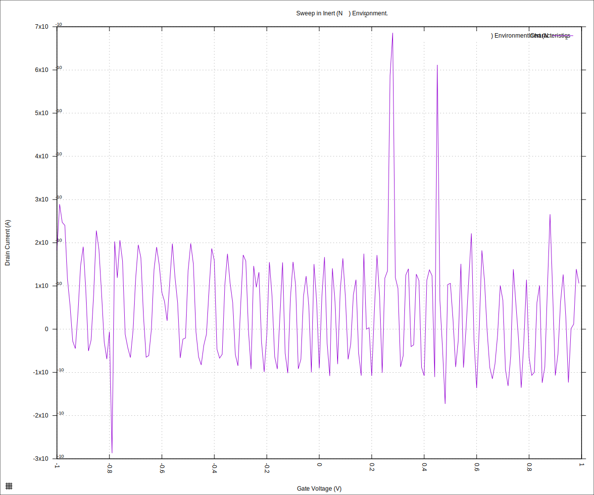
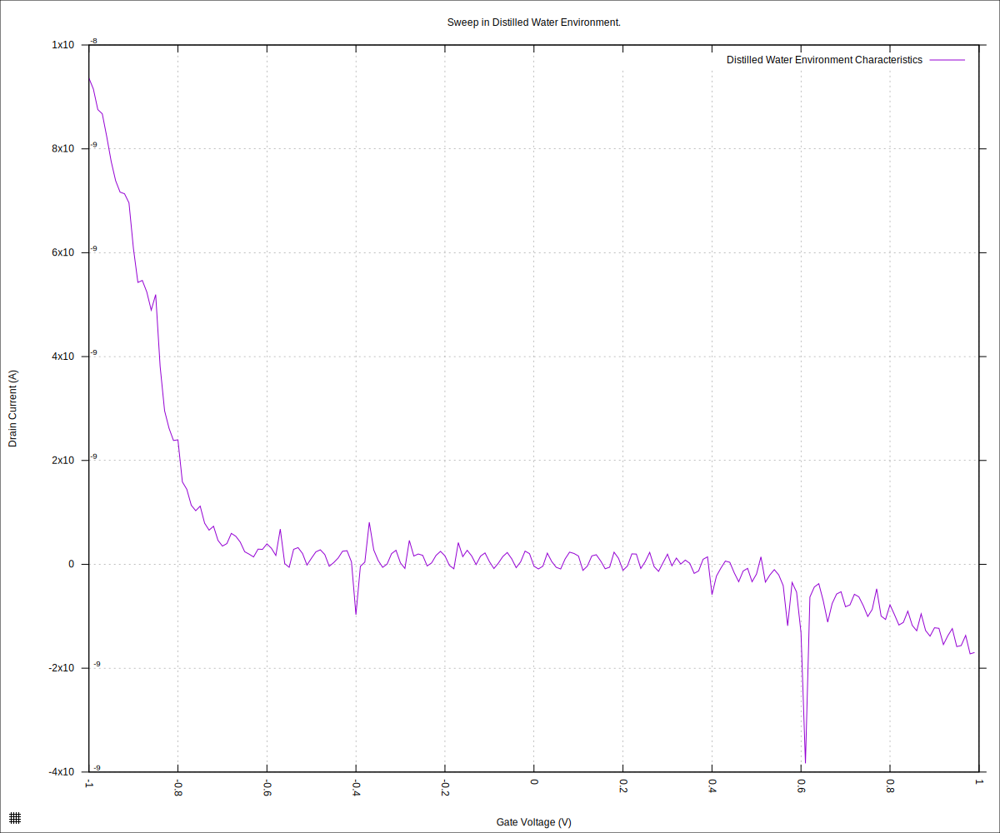
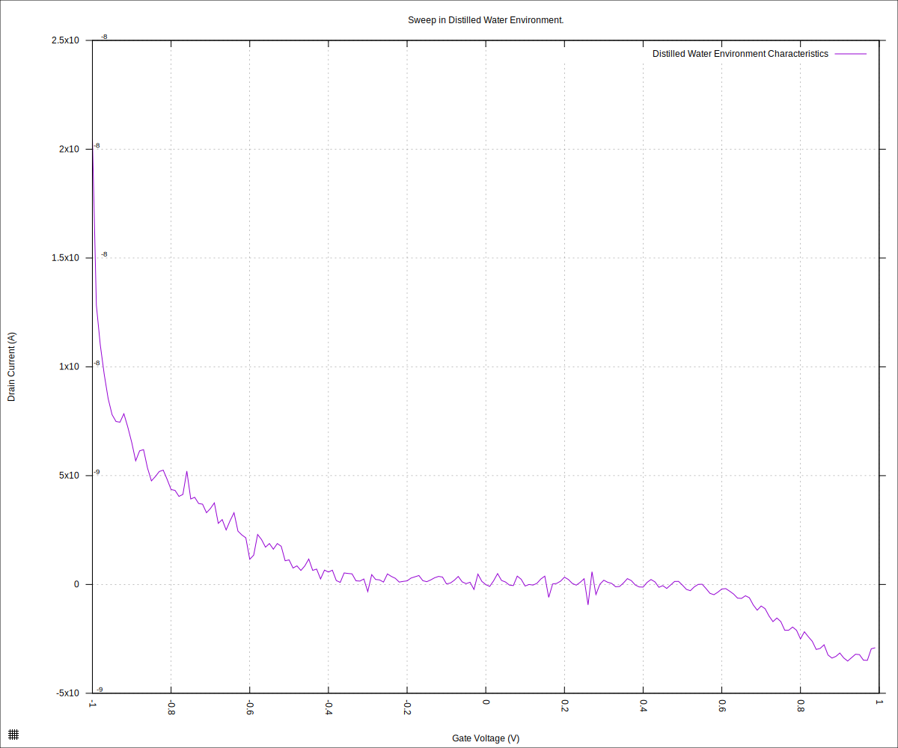
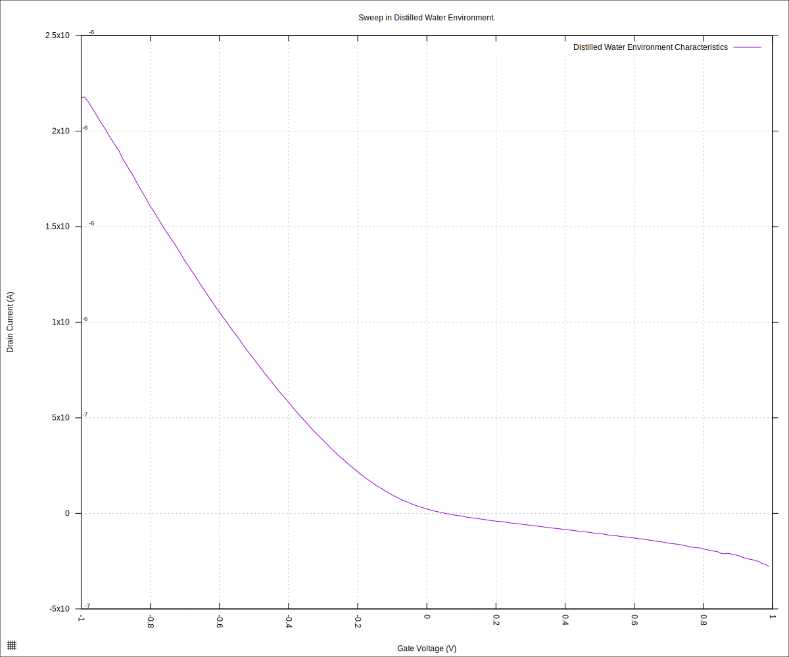
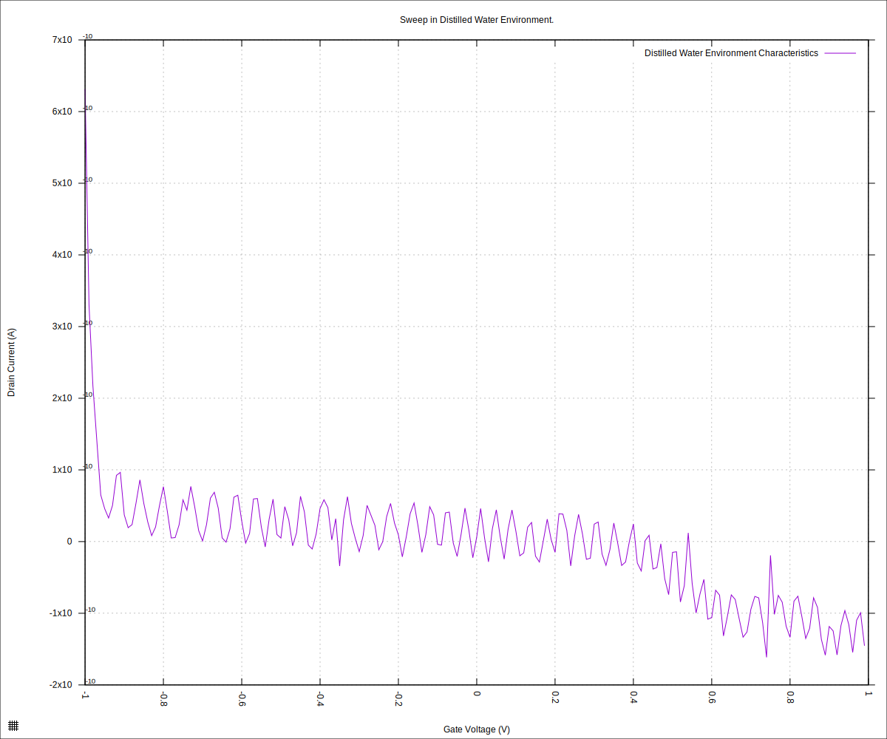

#+STARTUP: content
#+TITLE: Progress Report and Updates: 2026-02-23
#+PROPERTY: header-args:shell
#+LATEX_HEADER_EXTRA: \usepackage{svg}
#+BIBLIOGRAPHY: references.bib
#+CITE_EXPORT: natbib kluwer
#+LATEX_HEADER_EXTRA: \usepackage{fontspec}
#+LATEX: \setmainfont{Liberation Serif}
#+AUTO_TANGLE: t
#+OPTIONS: ^:{}

* Integration

There's a likelihood that on 2026-02-20, I ran the experiments with the
microfluidics device powered on and connected to the same USB hub as the SMU.

In a discussion with @erikg, we came to a realisation that grounding issues
might also be interfering with the readings we are getting.

The goal for the day, therefore, is to isolate the SMU from the microfluidics
device while doing measurements, then ensure they are both connected and powered
on while doing more measurements — before that, however, I'll work a little more
on the paper as I wait for the SMU to warm up, and stabilise its operation point.

** Paper

- Add some technical datasheets to list of references
- Do minor text and layout improvements

** Isolate SMU from Microfluidics Device

- [x] Connect SMU directly to the computer's USB port
- [x] Unplug Microfluidics device from power entirely
- [x] Put chip in, and reassemble the cartridge
- [ ] Take measurements
  - [ ] N_{2} Gas
  - [ ] Distilled water
  - [ ] 0.0005X PBS
  - [ ] 0.001X PBS

*** N_{2} Gas

We expect a mostly flat plot. To verify, we do the sweep, and extract the data for the positive channel voltage (V_{DS} = 50mV).

#+begin_src shell
  python3 sweep.py \
          --log-level debug \
          --smu-visa-address ASRL/dev/ttyUSB0::INSTR \
          --line-frequency 60 \
          --nplc 12.5005 \
          --gate_voltage 1.0 \
          --sweep_interval 0.01 \
          --channel-voltage 0.05 \
          > fd-test-01/2026-02-23/20260223-nitrogen-readings.csv \
          2>fd-test-01/2026-02-23/20260223-nitrogen-events.txt && \
      python3 isswisafre.py process-data \
              fd-test-01/2026-02-23/20260223-nitrogen-readings.csv \
              fd-test-01/2026-02-23/
#+end_src

This gave us [[file:static/20260223-nitrogen-events.txt][these logs]], [[file:static/20260223-nitrogen-readings.csv][this raw data]] and [[file:static/20260223-nitrogen-readings_positive.csv][this data for the positive channel voltage]].

Plotting the data:

#+begin_src gnuplot :tangle ./20260223-nitrogen-readings.gp
  load "./20260220-plotting-styles.gp"

  set output "./static/20260223-nitrogen-readings.svg"

  set title "Sweep in Inert (N_{2}) Environment."
  set xlabel "Gate Voltage (V)"
  set ylabel "Drain Current (A)"
  set datafile separator ","
  plot \
       "./static/20260223-nitrogen-readings_positive.csv" \
       using "measured_gate_voltage":"drain_current" \
       title "Inert (N_{2}) Environment Characteristics" \
       with lines
#+end_src

which gives us the plot:

#+CAPTION: Chip Characteristics: Inert (N_{2} gas) Environment
#+NAME: chip-xristics-inert-env

That does not look right. Let's try distilled water.

*** Distilled Water

The expected plot is a (mostly) smooth curve that bottoms out at the chips Dirac
point in the distilled water environment, before rising again. The
characteristics we get for distilled water, however, are:

#+begin_src shell
  python3 sweep.py \
          --log-level debug \
          --smu-visa-address ASRL/dev/ttyUSB0::INSTR \
          --line-frequency 60 \
          --nplc 12.5005 \
          --gate_voltage 1.0 \
          --sweep_interval 0.01 \
          --channel-voltage 0.05 \
          > fd-test-01/2026-02-23/20260223-water-readings.csv \
          2>fd-test-01/2026-02-23/20260223-water-events.txt && \
      python3 isswisafre.py process-data \
              fd-test-01/2026-02-23/20260223-water-readings.csv \
              fd-test-01/2026-02-23/
#+end_src

and plotting

#+begin_src gnuplot :tangle ./20260223-water-readings.gp
  load "./20260220-plotting-styles.gp"

  set output "./static/20260223-water-readings.svg"

  set title "Sweep in Distilled Water Environment."
  set xlabel "Gate Voltage (V)"
  set ylabel "Drain Current (A)"
  set datafile separator ","
  plot \
       "./static/20260223-water-readings_positive.csv" \
       using "measured_gate_voltage":"drain_current" \
       title "Distilled Water Environment Characteristics" \
       with lines
#+end_src

we get

#+CAPTION: Chip Characteristics: Distilled Water Environment
#+NAME: chip-xristics-water-env

This plot is very similar to that from 2026-02-20.

*** Conclusion

Even without running any other verifications, we can tell that something is
wrong from the plots relating to the inert and the distilled water environments.

** Use Drop-Type Reservoir

I disassembled the cartridge and put the original drop-type reservoir to use to
verify the chip's characteristics.

First

#+begin_src shell
  python3 sweep.py \
          --log-level debug \
          --smu-visa-address ASRL/dev/ttyUSB0::INSTR \
          --line-frequency 60 \
          --nplc 12.5005 \
          --gate_voltage 1.0 \
          --sweep_interval 0.01 \
          --channel-voltage 0.05 \
          > fd-test-01/2026-02-23/20260223-water-droptype-01-readings.csv \
          2>fd-test-01/2026-02-23/20260223-water-droptype-01-events.txt && \
      python3 isswisafre.py process-data \
              fd-test-01/2026-02-23/20260223-water-droptype-01-readings.csv \
              fd-test-01/2026-02-23/
#+end_src

and plotting that

#+begin_src gnuplot :tangle ./20260223-water-droptype-01-readings.gp
  load "./20260220-plotting-styles.gp"

  set output "./static/20260223-water-droptype-01-readings.svg"

  set title "Sweep in Distilled Water Environment."
  set xlabel "Gate Voltage (V)"
  set ylabel "Drain Current (A)"
  set datafile separator ","
  plot \
       "./static/20260223-water-droptype-01-readings_positive.csv" \
       using "measured_gate_voltage":"drain_current" \
       title "Distilled Water Environment Characteristics" \
       with lines
#+end_src

we get

#+CAPTION: Chip Characteristics: Distilled Water Environment (Drop-Type)
#+NAME: chip-xristics-water-env-droptype

That's not good. Something is definitely wrong!

Start troubleshooting the connections.

- Switch cartridge sides from  to B
- Change from "source 3" to "source 1"
- Make sure unconnected terminal contacts are not touching SMU

  

  Still not good!

  Dissassemble.

  Arrgghh! 🤦🏿 Human error. The chip was oriented wrong. Fix and retry.

  

  Whoops! That does not resolve the issue, at all.

  Start looking at the connections.

  Disassemble the cartridge and use the multimeter to check continuity.

  - All cartridge contacts have continuity, and no shorts
  - SMU Cables
    - Channel I: OK
    - Channel II: OK

The cables are wired correctly and have the appropriate continuity an no shorts.
The cartridge contacts also have the appropriate continuity an no shorts. The
problem, thus, is either in the chip itself, or the SMU.

I'll continue troubleshooting tomorrow.
