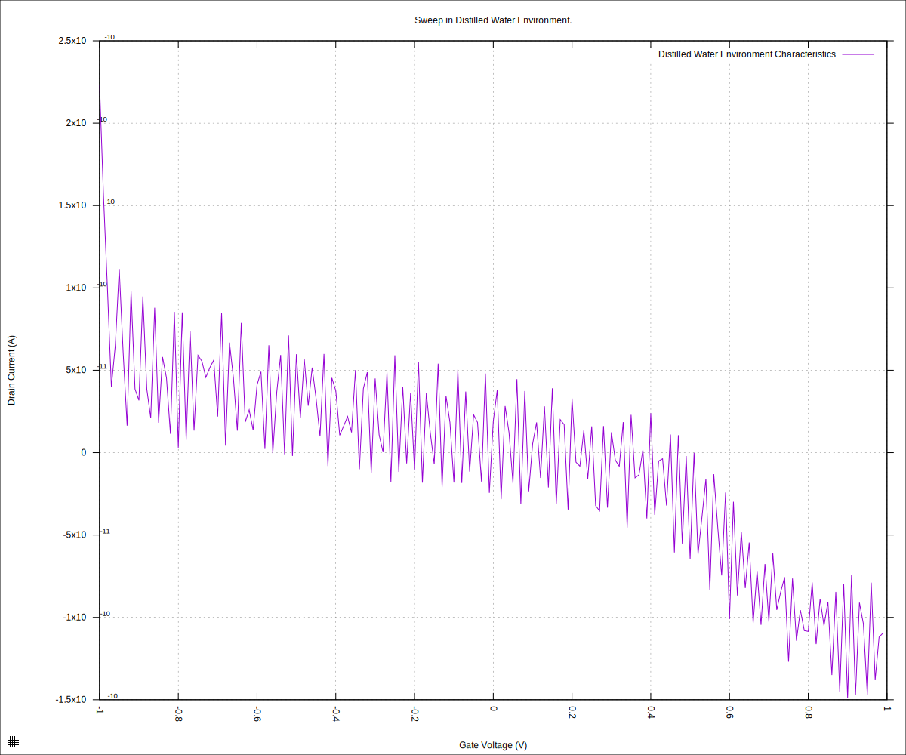
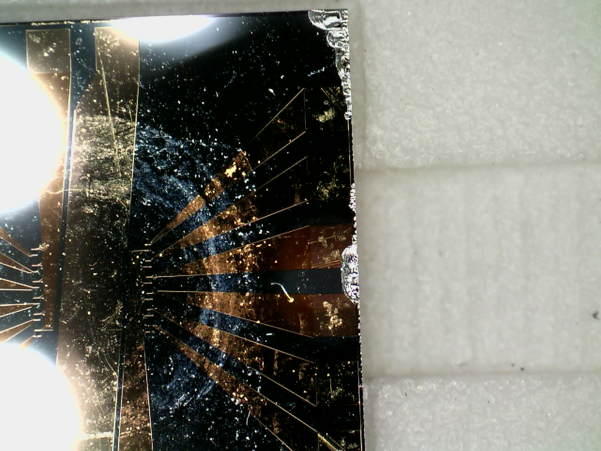
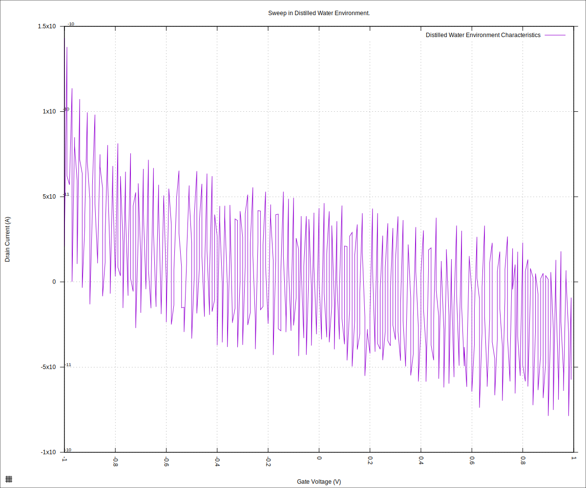

#+STARTUP: content
#+TITLE: Progress Report and Updates: 2026-02-26
#+PROPERTY: header-args:shell
#+LATEX_HEADER_EXTRA: \usepackage{svg}
#+BIBLIOGRAPHY: references.bib
#+CITE_EXPORT: natbib kluwer
#+LATEX_HEADER_EXTRA: \usepackage{fontspec}
#+LATEX: \setmainfont{Liberation Serif}
#+AUTO_TANGLE: t
#+OPTIONS: ^:{}

* Integration

** Troubleshoot SMU

I began by running basic test as indicated in the "Getting Started Guide" for the Keithley 2600B series of SMUs. The basic tests passed.

I looked into the reference manual to figure out other ways o troubleshooting issues. I made some changes to the code to allow raising errors from the Keithley SMU as Python exceptions:

- [[https://github.com/livingcodeslab/gfet-microfluidics-experiments/commit/4d8c4ce66b5027c54a1ec69a179ff25e22d5cf9f]]
- [[https://github.com/livingcodeslab/gfet-microfluidics-experiments/commit/9e9bdf3f7cb602741172a0190063f159a3292c18]]

That done, it was time to run a sweep with the drop-type reservoir in the cartridge to verify basic operation of the SMU.

- [x] Take cartridge from storage in nitrogen and hook it up to SMU
- [x] Drop 50µL of distilled water in the well
- [ ] Run sweep

  #+begin_src shell
    python3 sweep.py \
          --log-level debug \
          --smu-visa-address ASRL/dev/ttyUSB0::INSTR \
          --line-frequency 60 \
          --nplc 12.5005 \
          --gate_voltage 1.0 \
          --sweep_interval 0.01 \
          --channel-voltage 0.05 \
          --raise-keithley-errors \
          > fd-test-01/2026-02-26/20260226-water-readings.csv \
          2>fd-test-01/2026-02-26/20260226-water-events.txt && \
      python3 isswisafre.py process-data \
              fd-test-01/2026-02-26/20260226-water-readings.csv \
              fd-test-01/2026-02-26/
  #+end_src

  Running the SMU with the ~raise_keithley_errors~ set to ~True~ leads to extra communication overhead, therefore, the sweep is way slower than usual.

  No errors were raised during the sweep.

  The following data was produced from the sweep:

  - The sweep data
  - the logging information

We can now proceed to plotting the data:

#+begin_src gnuplot :tangle ./20260226-water-readings.gp
  load "./20260220-plotting-styles.gp"

  set output "./static/20260226-water-readings.svg"

  set title "Sweep in Distilled Water Environment."
  set xlabel "Gate Voltage (V)"
  set ylabel "Drain Current (A)"
  set datafile separator ","
  plot \
       "./static/20260226-water-readings_positive.csv" \
       using "measured_gate_voltage":"drain_current" \
       title "Distilled Water Environment Characteristics" \
       with lines
#+end_src

which gives us:

#+CAPTION: Chip Characteristics: Distilled Water Environment
#+NAME: 20260226-chip-xristics-water-env

and the data is still not what we expect. Why?

The chip was examined under a microscope, and it was found that despite regular cleanings, it has accumulated some grime on the surface:

#+CAPTION: Grimy Chip Surface
#+NAME: 2026-photo-grimy-chip

There was also some some chipping at the edges of the die as seen:

#+CAPTION: Chipped edges of the GFET-S20
#+NAME: 2026-photo-chipped-edge

These issues do not necessarily explain the weird results, but they might contribute something to the results.

** Change Chip

A different chip was taken, and examined. It also has some grime and some chipping, but otherwise looks good to use.

Let us collect data the data, and plot:

#+begin_src shell
  python3 sweep.py \
          --log-level debug \
          --smu-visa-address ASRL/dev/ttyUSB0::INSTR \
          --line-frequency 60 \
          --nplc 12.5005 \
          --gate_voltage 1.0 \
          --sweep_interval 0.01 \
          --channel-voltage 0.05 \
          --raise-keithley-errors \
          > fd-test-01/2026-02-26/20260226-02-water-readings.csv \
          2>fd-test-01/2026-02-26/20260226-02-water-events.txt && \
      python3 isswisafre.py process-data \
              fd-test-01/2026-02-26/20260226-02-water-readings.csv \
              fd-test-01/2026-02-26/
#+end_src

#+begin_src gnuplot :tangle ./20260226-02-water-readings.gp
  load "./20260220-plotting-styles.gp"

  set output "./static/20260226-02-water-readings.svg"

  set title "Sweep in Distilled Water Environment."
  set xlabel "Gate Voltage (V)"
  set ylabel "Drain Current (A)"
  set datafile separator ","
  plot \
       "./static/20260226-02-water-readings.csv" \
       using "measured_gate_voltage":"drain_current" \
       title "Distilled Water Environment Characteristics" \
       with lines
#+end_src

and we get:

#+CAPTION: Other Chip Characteristics: Distilled Water Environment
#+NAME: 20260226-02-chip-xristics-water-env

which is still, definitely wrong.

Even changing the port on the cartridge that the SMU was connected to did not fix the issue.

Could there be  a loose connection?

This needs better verification of the fundamentals: design some basic circuit to use to verify the basic operation of both channels of the SMU.

*** Update

After requesting a look over my shoulder, it became obvious that the drain currents in the latest plots have been ridiculously small — in the order of 10^{-9} and lower. It is likely we are not getting a good contact with the chip inside cartridge. I'll verify this starting tomorrow.

  
** O-Rings

The current Buna-N O-rings in use are leaving residue on the chips. Consideration should be made for other materials for the O-rings, such as:

- EPDM
- Viton
- FFKM (Kalrez)
- PTFE

** Miscellaneous

- Commit and push uncommitted changes
  - https://github.com/livingcodeslab/gfet-microfluidics-experiments/commit/d7bb6eb7865a737bd4771d375909b960a821b748
    - https://github.com/livingcodeslab/gfet-microfluidics-experiments/commit/75ddd4eec7e92357e3f7d949a6f32ea98afc1bae
    - https://github.com/livingcodeslab/gfet-microfluidics-experiments/commit/f58997107cb29b197c3c4042d512b843ffc6ac50
    - https://github.com/livingcodeslab/gfet-microfluidics-experiments/commit/cc74d389f34a6cb3ba67ae58302a89ae235a1774
