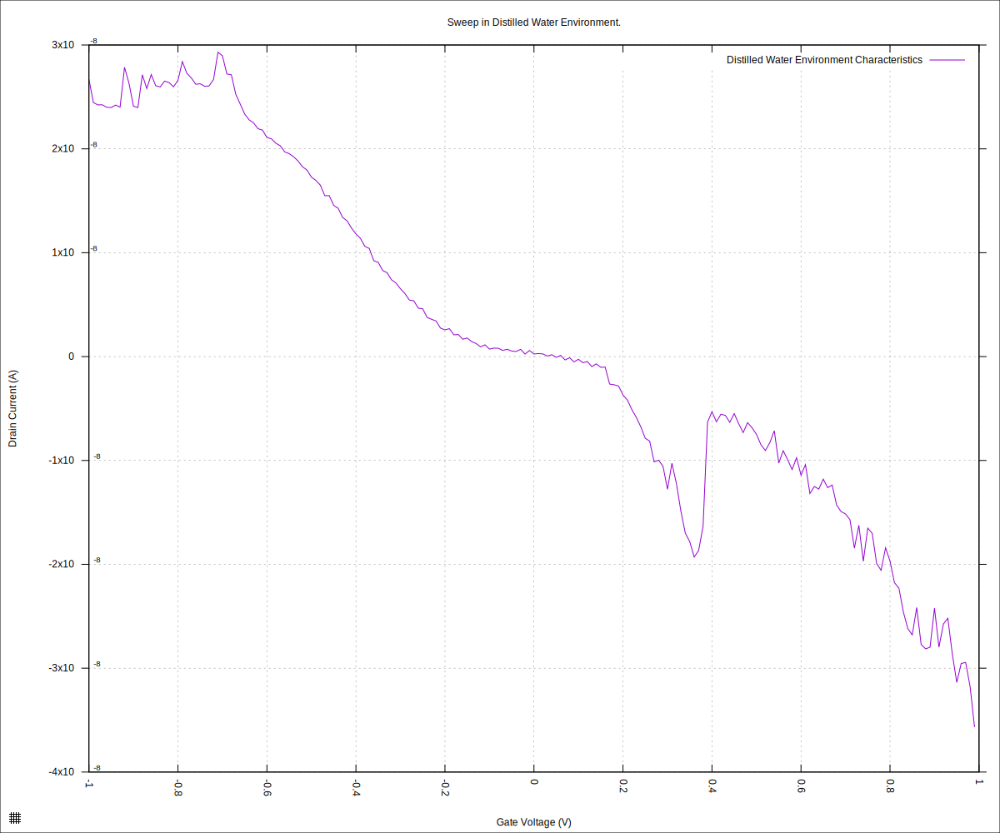
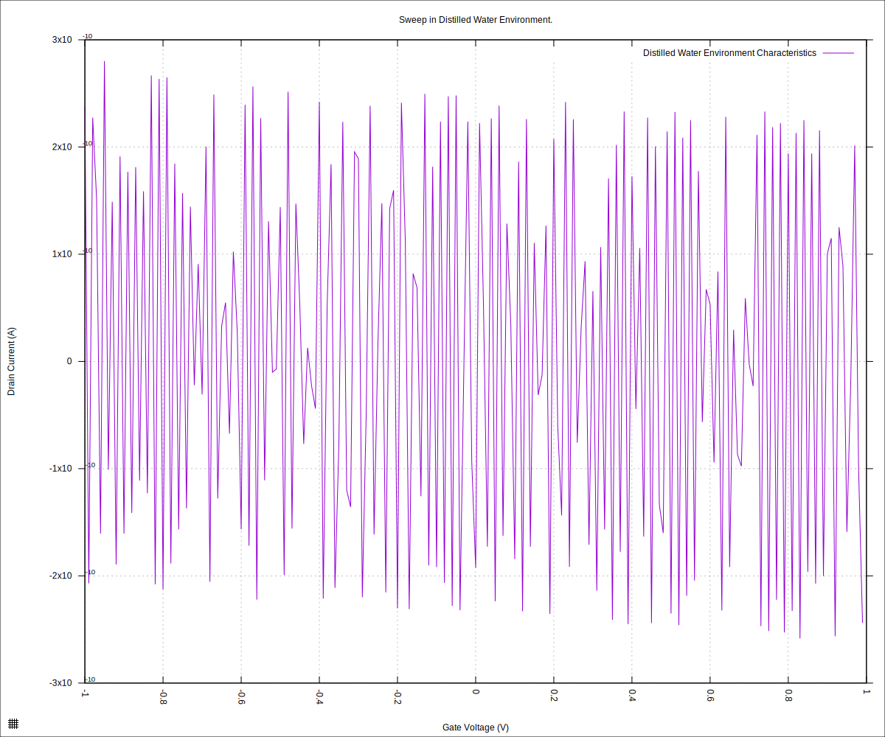

#+STARTUP: content
#+TITLE: Progress Report and Updates: 2026-02-27
#+PROPERTY: header-args:shell
#+LATEX_HEADER_EXTRA: \usepackage{svg}
#+BIBLIOGRAPHY: references.bib
#+CITE_EXPORT: natbib kluwer
#+LATEX_HEADER_EXTRA: \usepackage{fontspec}
#+LATEX: \setmainfont{Liberation Serif}
#+AUTO_TANGLE: t
#+OPTIONS: ^:{}

* Integrations

** Fix Contacts to Chip

The pogo pins that are meant to contact the chip were bent away from the chip just enough, we suspect, to make fleeting contact. That'd explain some of the weirdness we were experiencing.

These were straightened, and a sweep ran:

#+begin_src shell
  python3 sweep.py \
          --log-level debug \
          --smu-visa-address ASRL/dev/ttyUSB0::INSTR \
          --line-frequency 60 \
          --nplc 12.5005 \
          --gate_voltage 1.0 \
          --sweep_interval 0.01 \
          --channel-voltage 0.05 \
          --raise-keithley-errors \
          > fd-test-01/2026-02-27/20260227-water-readings.csv \
          2>fd-test-01/2026-02-27/20260227-water-events.txt && \
      python3 isswisafre.py process-data \
              fd-test-01/2026-02-27/20260227-water-readings.csv \
              fd-test-01/2026-02-27/
#+end_src

and plot

#+begin_src gnuplot :tangle ./20260227-water-readings.gp
  load "./20260220-plotting-styles.gp"

  set output "./static/20260227-water-readings.svg"

  set title "Sweep in Distilled Water Environment."
  set xlabel "Gate Voltage (V)"
  set ylabel "Drain Current (A)"
  set datafile separator ","
  plot \
       "./static/20260227-water-readings_positive.csv" \
       using "measured_gate_voltage":"drain_current" \
       title "Distilled Water Environment Characteristics" \
       with lines
#+end_src

which gave:

#+CAPTION: Chip Characteristics: Distilled Water Environment
#+NAME: 20260227-chip-xristics-water-env

Okay, same issue. It looks like the pogo pins are not the issue. Keep investigating...

After wiggling the round connector onto the cartridge, and running the sweep again, we got

#+CAPTION: Chip Characteristics: Distilled Water Environment
#+NAME: 20260227-02-chip-xristics-water-env

Okay, that reveals a possible cause of the error. The round connector might be the culprit.

Disconnect the cables from the SMU and take the cartridge apart. Now verify continuity from the end of the cables (at the SMU connections) to the chip contacts (the pogo-pins in the cartridge).

There is good conductivity from end to end an no detectible shorts and/or crosstalk.

Time to hit up claude to see whether I can get better ideas on how to troubleshoot: I got some recommendations I will look into and see whether that fixes things.
