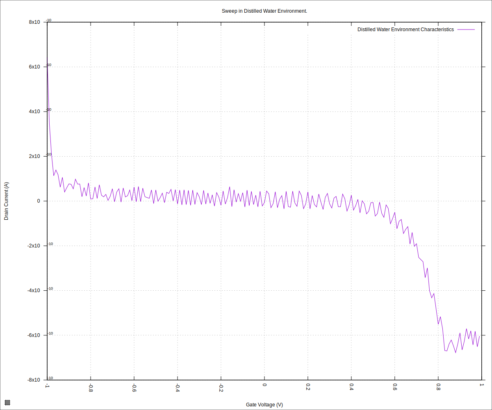
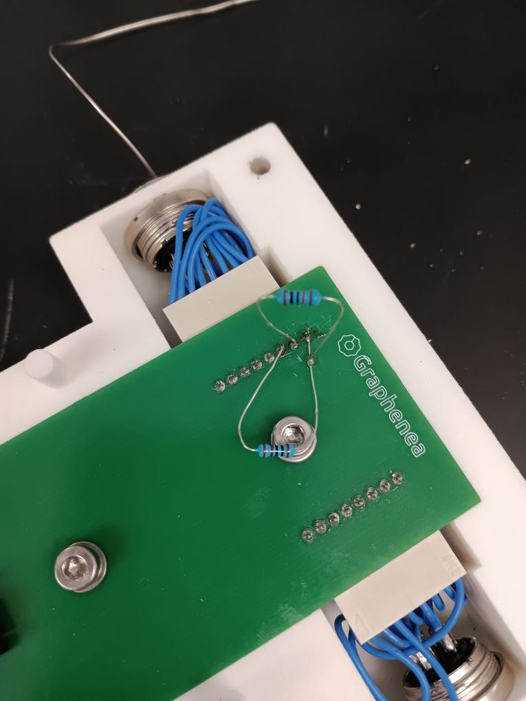
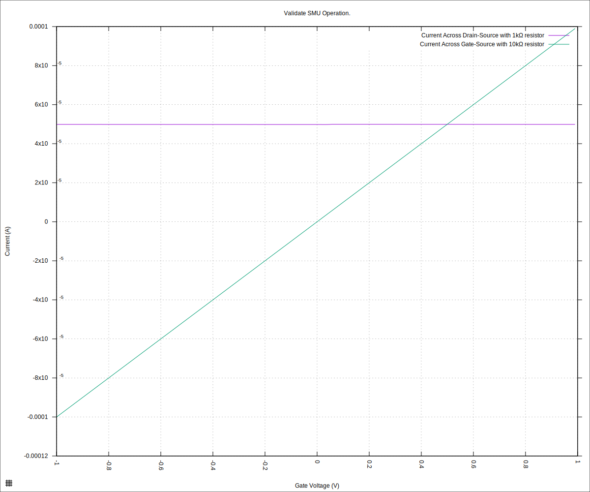
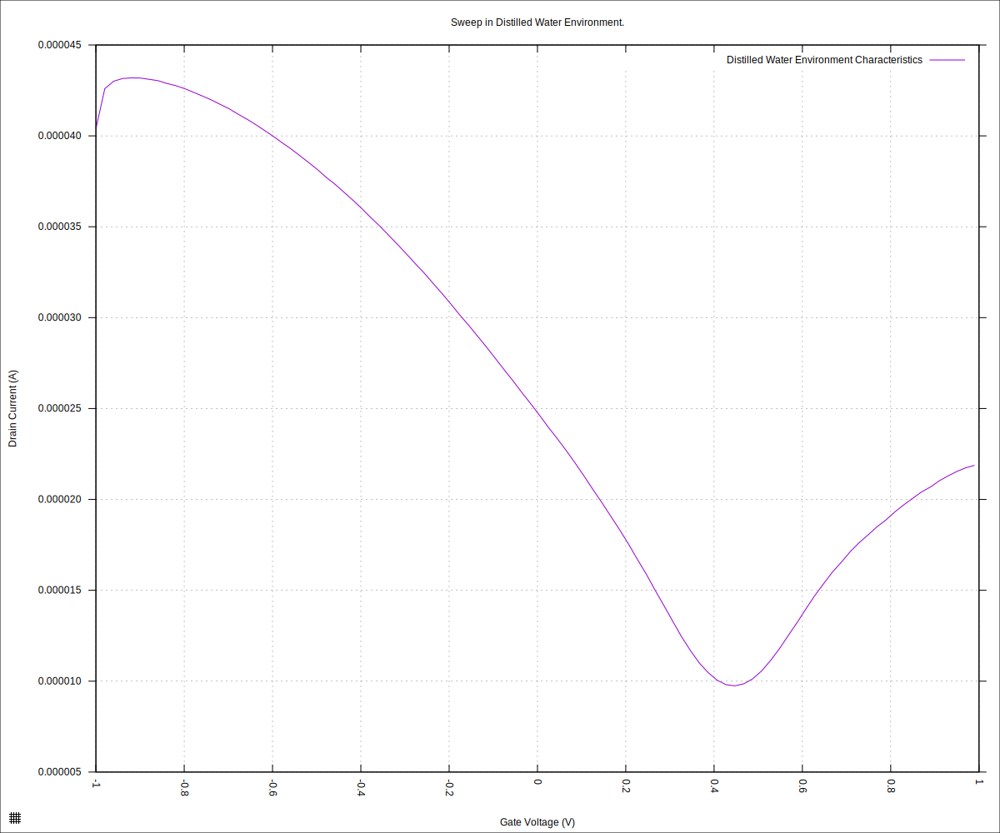

#+STARTUP: content
#+TITLE: Progress Report and Updates: 2026-03-02
#+PROPERTY: header-args:shell
#+LATEX_HEADER_EXTRA: \usepackage{svg}
#+BIBLIOGRAPHY: references.bib
#+CITE_EXPORT: natbib kluwer
#+LATEX_HEADER_EXTRA: \usepackage{fontspec}
#+LATEX: \setmainfont{Liberation Serif}
#+AUTO_TANGLE: t
#+OPTIONS: ^:{}

* Integration

** Explicitly Set Current Limits

As part of the troubleshooting efforts, explicitly set the current limits as suggested by Claude and run the experiment again.

We begin by putting the cabling back together, reassemble the cartridge, and connect the SMU.

Update the code to explicitly set the current limits and verify that the serial connection is passing the communication through correctly:

- https://github.com/livingcodeslab/gfet-microfluidics-experiments/commit/471eac3787a785cf3d07ae42435b344d0f9de5b2
- https://github.com/livingcodeslab/gfet-microfluidics-experiments/commit/29a92406623bd8a74a84344d68eba255aedee5d1
- https://github.com/livingcodeslab/gfet-microfluidics-experiments/commit/7fd1f43df32a30777c6c327eb1fab90d7bd27c9a

and then, run the experiment:

#+begin_src shell
  python3 sweep.py \
          --log-level debug \
          --smu-visa-address ASRL/dev/ttyUSB0::INSTR \
          --line-frequency 60 \
          --nplc 12.5005 \
          --gate_voltage 1.0 \
          --sweep_interval 0.01 \
          --channel-voltage 0.05 \
          --raise-keithley-errors \
          > fd-test-01/20260302/20260302-water-readings.csv \
          2>fd-test-01/20260302/20260302-water-events.txt && \
      python3 isswisafre.py process-data \
              fd-test-01/20260302/20260302-water-readings.csv \
              fd-test-01/20260302/
#+end_src

and plotting

#+begin_src gnuplot :tangle ./20260302-water-readings.gp
  load "./20260220-plotting-styles.gp"

  set output "./static/20260302-water-readings.svg"

  set title "Sweep in Distilled Water Environment."
  set xlabel "Gate Voltage (V)"
  set ylabel "Drain Current (A)"
  set datafile separator ","
  plot \
       "./static/20260302-water-readings_positive.csv" \
       using "measured_gate_voltage":"drain_current" \
       title "Distilled Water Environment Characteristics" \
       with lines
#+end_src

we get the following plot

#+CAPTION: Chip Characteristics: Distilled Water Environment
#+NAME: 20260302-chip-xristics-water-env

This indicates that the problem is not resolved by explicitly specifying the current limits.

** Set up known resistors

We now try and verify whether the SMU might be experiencing subtle issues that
are leading to wrong values.

We solder a 10kΩ resistor across the "gate-to-source" part of the circuit and a 1kΩ resistor across the "drain-to-source" part of the circuit:

#+CAPTION: Soldered 10kΩ and 1kΩ resitors to verify SMU operation
#+NAME: smu-verification-resistors

Now, run the sweep with the resistors in place of the chip.

#+begin_src shell
  python3 sweep.py \
          --log-level debug \
          --smu-visa-address ASRL/dev/ttyUSB0::INSTR \
          --line-frequency 60 \
          --nplc 12.5005 \
          --gate_voltage 1.0 \
          --sweep_interval 0.01 \
          --channel-voltage 0.05 \
          --raise-keithley-errors \
          > fd-test-01/20260302/20260302-02-resistors-readings.csv \
          2>fd-test-01/20260302/20260302-02-resistors-events.txt && \
      python3 isswisafre.py process-data \
              fd-test-01/20260302/20260302-02-resistors-readings.csv \
              fd-test-01/20260302/
#+end_src

With resistors being (mostly) linear devices, we expect the currents to vary linearly with the voltages.

Since the channel voltage (drain-source) simply switches from -50V to +50V, we expect a steady current that is given by Ohm's law, $R=\frac{V}{I}$, in this case, $R=\frac{+/- 50mV}{1kΩ} = 0.00005A = 50µA$.

The currents on the gate-source channel should vary linearly with the voltage across.

When we plot the results, we get:

#+begin_src gnuplot :tangle ./20260302-02-resistors-readings.gp
  load "./20260220-plotting-styles.gp"

  set output "./static/20260302-02-resistors-readings.svg"

  set title "Validate SMU Operation."
  set xlabel "Gate Voltage (V)"
  set ylabel "Current (A)"
  set datafile separator ","
  plot \
       "./static/20260302-02-resistors-readings_positive.csv" \
       using "measured_gate_voltage":"drain_current" \
       title "Current Across Drain-Source with 1kΩ resistor" \
       with lines, \
       "./static/20260302-02-resistors-readings_positive.csv" \
       using "measured_gate_voltage":"measured_gate_current" \
       title "Current Across Gate-Source with 10kΩ resistor" \
       with lines
#+end_src

#+CAPTION: Validate SMU Operations Using Resistors
#+NAME: 20260302-02-resistor-readings

and we see the "Current Across Drain-Source with 1kΩ resistor" is flat with a value at approximately 50µA.

The current labelled "Current Across Gate-Source with 10kΩ resistor" varies linearly with the sweeping gate-source voltage. Taking a point, e.g. -0.6V, we see the corresponding current value is -6x10^{-5}A, which is what we expect.

This verifies that the SMU is working as expected. The problem with the data, when using the chip is elsewhere.

Now we can restore the cartridge to normal operations:
- [x] Desolder the resistors
- [x] Verify continuity of desoldered and resoldered contact points
- [x] Verify there are no shorts

** Problem Points

At this point, we have verified the conductors, and also that the SMU is working as expected. This leaves the following as possible problem points:

- The contact points between pogo-pins and the chip
- The chips we are using might be broken

The first could be caused by erosion of contact points/pins, or warping of the cartridge material leading to the chip seating incorrectly.

The second is trickier to figure out — perhaps the chips could have experienced physical damage due to tightening of the cartridge?

To rule out the second, we'll break out a completely new chip (previously unused) and run the sweep with it. If that works, then we can tentatively ascribe the problems to physical damage of older chips. Should we still get the same problems, then the first problem point is likely to be the cause.

*** Breaking out New Chip

#+begin_src shell
  python3 sweep.py \
          --log-level debug \
          --smu-visa-address ASRL/dev/ttyUSB0::INSTR \
          --line-frequency 60 \
          --nplc 12.5005 \
          --gate_voltage 1.0 \
          --sweep_interval 0.01 \
          --channel-voltage 0.05 \
          --raise-keithley-errors \
          > fd-test-01/20260302/20260302-03-water-readings.csv \
          2>fd-test-01/20260302/20260302-03-water-events.txt && \
      python3 isswisafre.py process-data \
              fd-test-01/20260302/20260302-03-water-readings.csv \
              fd-test-01/20260302/
#+end_src

and plotting

#+begin_src gnuplot :tangle ./20260302-03-water-readings.gp
  load "./20260220-plotting-styles.gp"

  set output "./static/20260302-03-water-readings.svg"

  set title "Sweep in Distilled Water Environment."
  set xlabel "Gate Voltage (V)"
  set ylabel "Drain Current (A)"
  set datafile separator ","
  plot \
       "./static/20260302-03-water-readings_positive.csv" \
       using "measured_gate_voltage":"drain_current" \
       title "Distilled Water Environment Characteristics" \
       smooth csplines \
       with lines
#+end_src

Huzzah! The new chip gives us the expected curve!

#+CAPTION: Chip Characteristics: Distilled Water Environment (New, previously unused chip)
#+NAME: 20260302-03-water-readings

It looks like the older chips might have physical damage, or something is preventing good electrical contact between the pogo-pins and the chips.

*NOTE*: There is some warping of the cartridge: when putting in the new chip, it did not sit flat, there was some give.
*NOTE*: On inspectio of the flowcell that was in use previously, it was found to have a crack. This points to there being physical damage on the chips that were used with that flowcell.

** Next Steps

- Order new O-rings with a different material, FFKM or PTFE
- Inspect older chips: check for cracks and other forms of physical damage
- Check sweep using flowcell and syringe (Take care not to tigten the cartridge too much)
- Perhaps, improve the design of the flowcell
  - Take measurements of the flowcell's "tongue" and compare with Graphenea's reservoir
