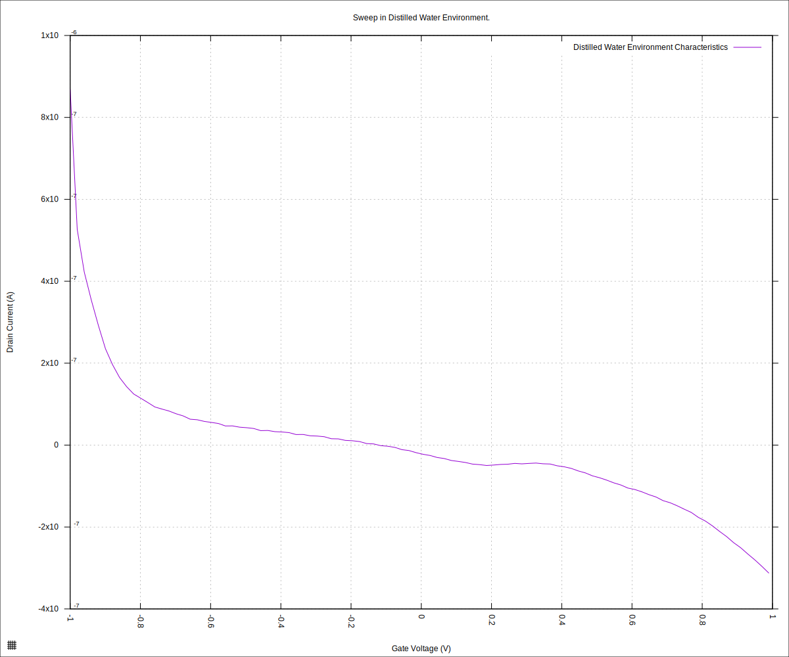
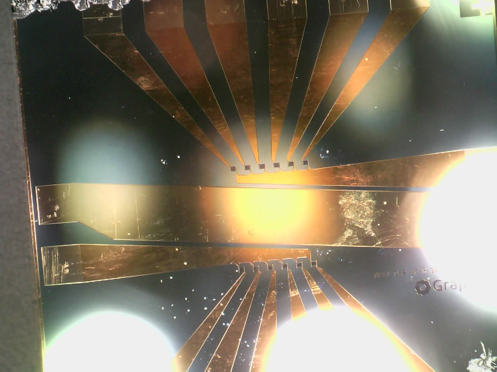
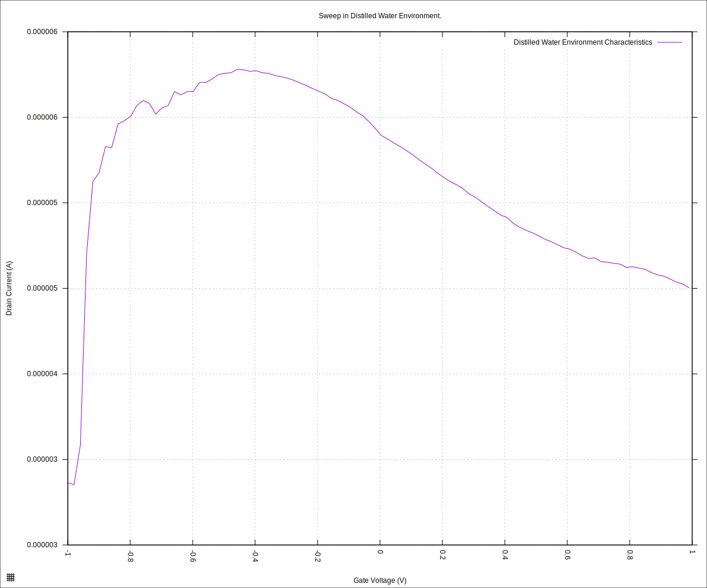
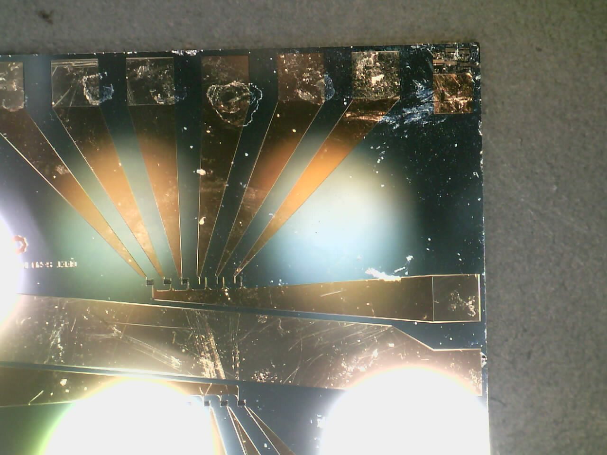
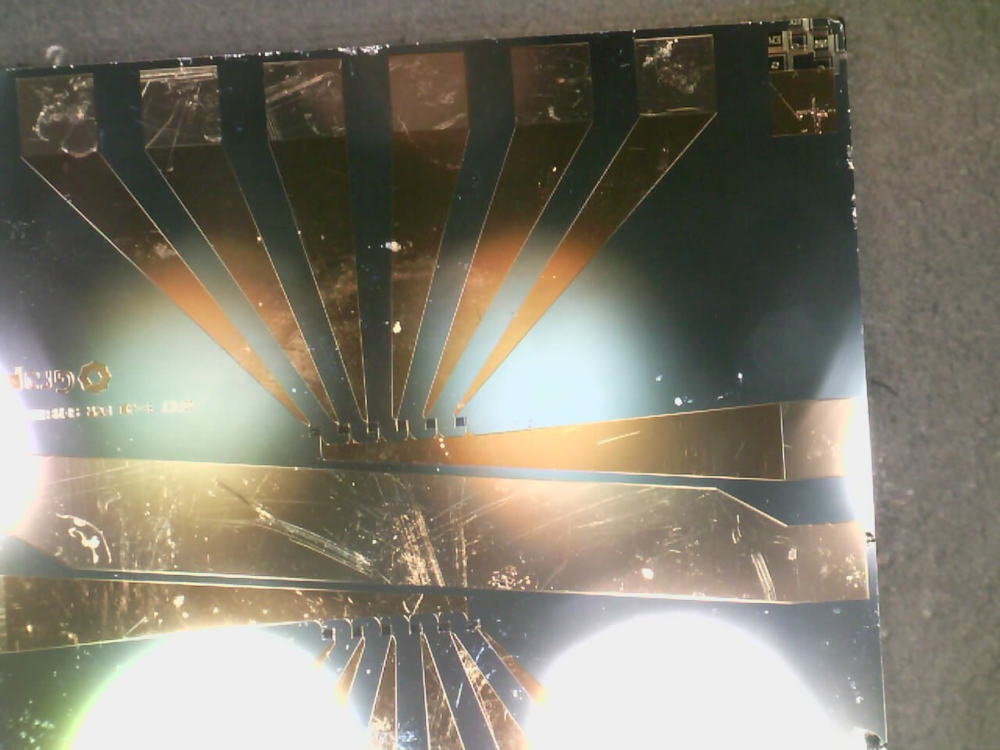
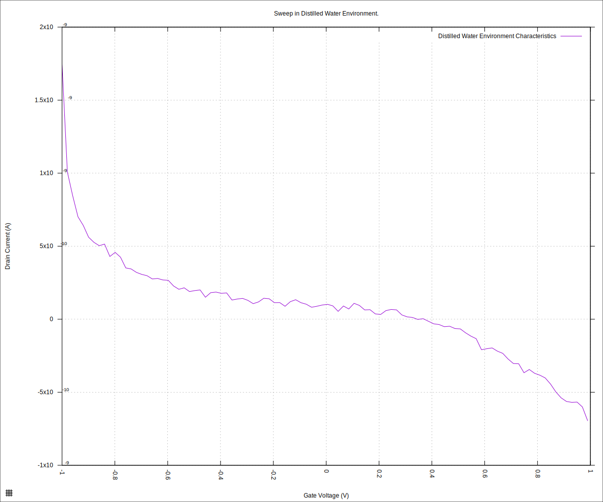

#+STARTUP: content
#+TITLE: Progress Report and Updates: 2026-03-05
#+PROPERTY: header-args:shell
#+LATEX_HEADER_EXTRA: \usepackage{svg}
#+BIBLIOGRAPHY: references.bib
#+CITE_EXPORT: natbib kluwer
#+LATEX_HEADER_EXTRA: \usepackage{fontspec}
#+LATEX: \setmainfont{Liberation Serif}
#+AUTO_TANGLE: t
#+OPTIONS: ^:{}

* Integration

On Monday, 02^{nd} March 2026, we verified that the problem in the readings came from the chips themselves. It looks like the older chips suffered physical damage, likely from the flowcell putting too much pressure against the chips.

Today, the focus is on attempting to put in the flowcell, but without a lot of pressure, and attempting to get readings with the flowcell in place.

** Readings With FlowCell

- [x] Dissassemble cartridge — remove drop-type reservoir
- [x] Assemble the cartridge — put spacers between the upper and lower portions
  of the cartridge to avoid over-tightening and breaking the new chip
- [x] Flow a bit of distilled water through the flowcell using a syringe to test
  for leakages
- [ ] Get readings with flowcell

With that in place, we now attempt getting readings. Fingers-crossed 🤞that I didn't break the new chip.

#+begin_src shell
  python3 sweep.py \
          --log-level debug \
          --smu-visa-address ASRL/dev/ttyUSB0::INSTR \
          --line-frequency 60 \
          --nplc 12.5005 \
          --gate_voltage 1.0 \
          --sweep_interval 0.01 \
          --channel-voltage 0.05 \
          --raise-keithley-errors \
          > fd-test-01/20260305/20260305-01-water-readings.csv \
          2>fd-test-01/20260305/20260305-01-water-events.txt && \
      python3 isswisafre.py process-data \
              fd-test-01/20260305/20260305-01-water-readings.csv \
              fd-test-01/20260305/
#+end_src

and plotting

#+begin_src gnuplot :tangle ./20260305-01-water-readings.gp
  load "./20260220-plotting-styles.gp"

  set output "./static/20260305-01-water-readings.svg"

  set title "Sweep in Distilled Water Environment."
  set xlabel "Gate Voltage (V)"
  set ylabel "Drain Current (A)"
  set datafile separator ","
  plot \
       "./static/20260305-01-water-readings_positive.csv" \
       using "measured_gate_voltage":"drain_current" \
       title "Distilled Water Environment Characteristics" \
       smooth csplines \
       with lines
#+end_src

we get:

#+CAPTION: Chip Characteristics: Distilled Water Environment
#+NAME: 20260305-01-water-readings

and it looks like the new chip is now broken too.

Take the chip out and inspect for cracks and other obvious physical defects:

#+CAPTION: Inspection for Damage
#+NAME: 20260305-01-InspectForDamage

There were no obvious cracks visible across the chip. There was still a lot of the residue from the Buna-N o-ring, however.

I attempt to clean the top of the chip with a tissue to get rid of the residue.

#+CAPTION: Chip surface after wiping with tissue
#+NAME: 20260305-01-RemoveResidue

#+begin_src shell
  python3 sweep.py \
          --log-level debug \
          --smu-visa-address ASRL/dev/ttyUSB0::INSTR \
          --line-frequency 60 \
          --nplc 12.5005 \
          --gate_voltage 1.0 \
          --sweep_interval 0.01 \
          --channel-voltage 0.05 \
          --raise-keithley-errors \
          > fd-test-01/20260305/20260305-02-water-readings.csv \
          2>fd-test-01/20260305/20260305-02-water-events.txt && \
      python3 isswisafre.py process-data \
              fd-test-01/20260305/20260305-02-water-readings.csv \
              fd-test-01/20260305/
#+end_src

and plotting

#+begin_src gnuplot :tangle ./20260305-02-water-readings.gp
  load "./20260220-plotting-styles.gp"

  set output "./static/20260305-02-water-readings.svg"

  set title "Sweep in Distilled Water Environment."
  set xlabel "Gate Voltage (V)"
  set ylabel "Drain Current (A)"
  set datafile separator ","
  plot \
       "./static/20260305-02-water-readings_positive.csv" \
       using "measured_gate_voltage":"drain_current" \
       title "Distilled Water Environment Characteristics" \
       smooth csplines \
       with lines
#+end_src

we get

#+CAPTION: Chip Characteristics: Distilled Water Environment (after wiping)
#+NAME: 20260305-02-water-readings

Hmm, it's reminiscent of the curve from the "new unused chip" in the -1.0V to -0.8V gate current range.

It is possible that the flowcell material, or the improvised seal, or both, might be "leaking" material into the distilled water that alters the characteristics of the chip significantly.

The flowcell material is defined as:
#+begin_example
- technology: mSLA Standard
- material: Resin Nylon Black (Tough, 45% elongation)
- color: Black
#+end_example

** Clean Older Chip

Now, to test with one of the older, "broken" chips. I physically wiped the surface of the chip with clean-room paper held with a tweezer and that got rid of a significant amount of the grime on the surface.

Here is how the chip looked before:

and here is how it looked after wiping:

Now running a sweep with the chip after wiping:

#+begin_src shell
  python3 sweep.py \
          --log-level debug \
          --smu-visa-address ASRL/dev/ttyUSB0::INSTR \
          --line-frequency 60 \
          --nplc 12.5005 \
          --gate_voltage 1.0 \
          --sweep_interval 0.01 \
          --channel-voltage 0.05 \
          --raise-keithley-errors \
          > fd-test-01/20260305/20260305-03-water-readings.csv \
          2>fd-test-01/20260305/20260305-03-water-events.txt && \
      python3 isswisafre.py process-data \
              fd-test-01/20260305/20260305-03-water-readings.csv \
              fd-test-01/20260305/
#+end_src

and plotting

#+begin_src gnuplot :tangle ./20260305-03-water-readings.gp
  load "./20260220-plotting-styles.gp"

  set output "./static/20260305-03-water-readings.svg"

  set title "Sweep in Distilled Water Environment."
  set xlabel "Gate Voltage (V)"
  set ylabel "Drain Current (A)"
  set datafile separator ","
  plot \
       "./static/20260305-03-water-readings_positive.csv" \
       using "measured_gate_voltage":"drain_current" \
       title "Distilled Water Environment Characteristics" \
       smooth csplines \
       with lines
#+end_src

we get:

#+CAPTION: Chip Characteristics: Distilled Water Environment (old chip, after wiping)
#+NAME: 20260305-03-water-readings

It does not seem to have made much of a change for the older chip.
