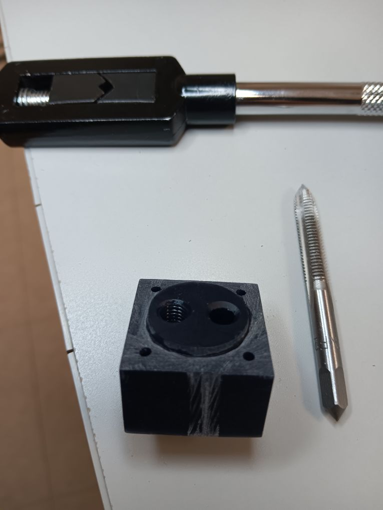
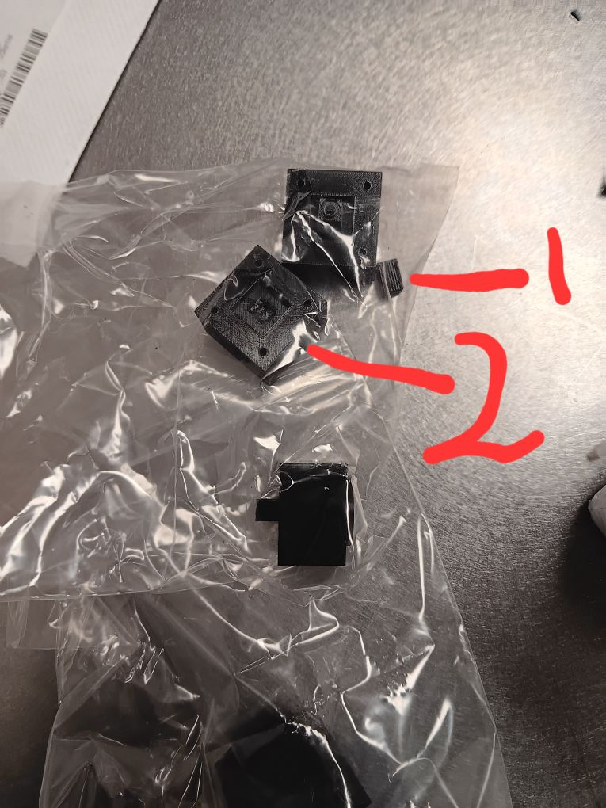
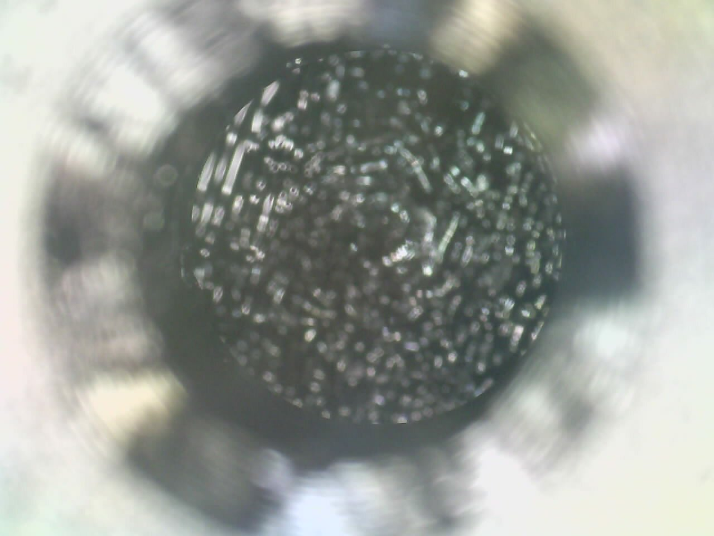
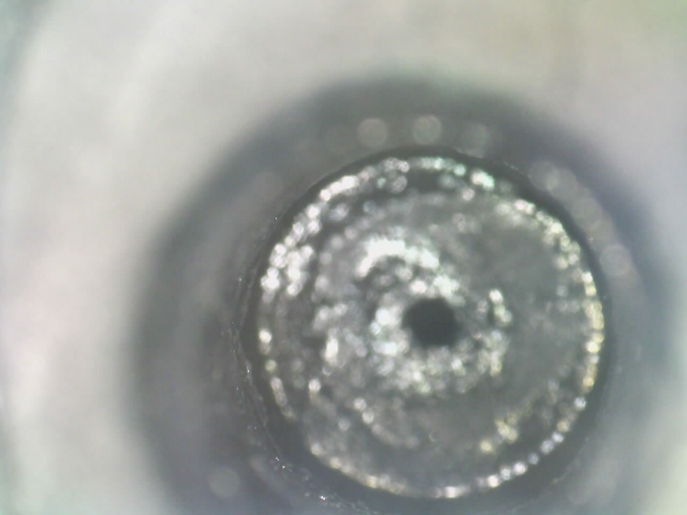

#+STARTUP: content
#+TITLE: Progress Report and Updates: 2026-04-06
#+PROPERTY: header-args:shell
#+LATEX_HEADER_EXTRA: \usepackage{svg}
#+BIBLIOGRAPHY: references.bib
#+CITE_EXPORT: natbib kluwer
#+LATEX_HEADER_EXTRA: \usepackage{fontspec}
#+LATEX: \setmainfont{Liberation Serif}
#+AUTO_TANGLE: t
#+OPTIONS: ^:{}

* Integration

** Flowcells: Cutting Threads

I began the day by familiarising myself with the thread-cutting taps and dies,
and the requirements for cutting threads.

I proceeded to attempt cutting the thread using the 1/4"-28 thread tap, holding
the workpiece firmly in one hand. This was mostly successful - the threads were
cut, and the flangeless peek connector seems to thread through correctly. The
thread is also crisp and clean looking.

#+CAPTION: The thread was cut in the hole on the left hole, while the hole on the right was untouched.
#+NAME: fig:20260406-FC-manual-thread-cut

** Flowcells: Evaluate New Prints

The new 3D-prints of the flowcell arrived.

It was immediately noted that one of the adapters was broken:

#+CAPTION: The small piece (labelled as 1) broke off from the main body, labelled as 2.
#+NAME: fig:20260406-FC-broken-cell

I then looked at whether there was flow through the channels. I did this by
dropping a few drops of water into each hole and waiting to see whether the
water flowed out the other end of the channel. None of the holes, in any of the
flowcells seemed to have any flow.

To verify, I did a manual inspection of the new 3D prints and compared them with
the older ones.

#+CAPTION: No channel visible in the hole in the new prints
#+NAME: fig:20260406-FC-no-channel

#+CAPTION: Channel visible in the hole in the older prints
#+NAME: fig:20260406-FC-channel-visible

The Fused Deposition Modeling (FDM) print, even with a 0.2mm nozzle, could not
(apparently) print the flowcell with the channels being left intact.

** Search for Other Printers

I did a search for other 3D printing service providers (besides Upside Parts) and came up with the following:

- Protolabs: https://www.protolabs.com/services/3d-printing/
- Craft Cloud: https://craftcloud3d.com/
  This one is some sort of aggregator/marketplace where you can find different manufacturers
- Xometry: https://www.xometry.com/
  This one is a marketplace of sorts

It looks like the best option is to go with Protolabs, and use the SLA
technology with the materials WaterShed XC 11122 or Somos 9120.
