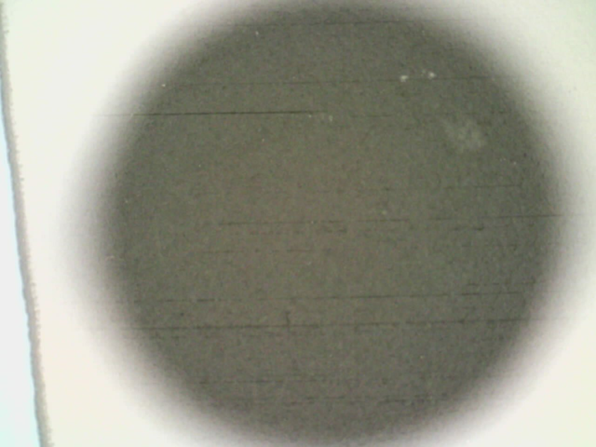
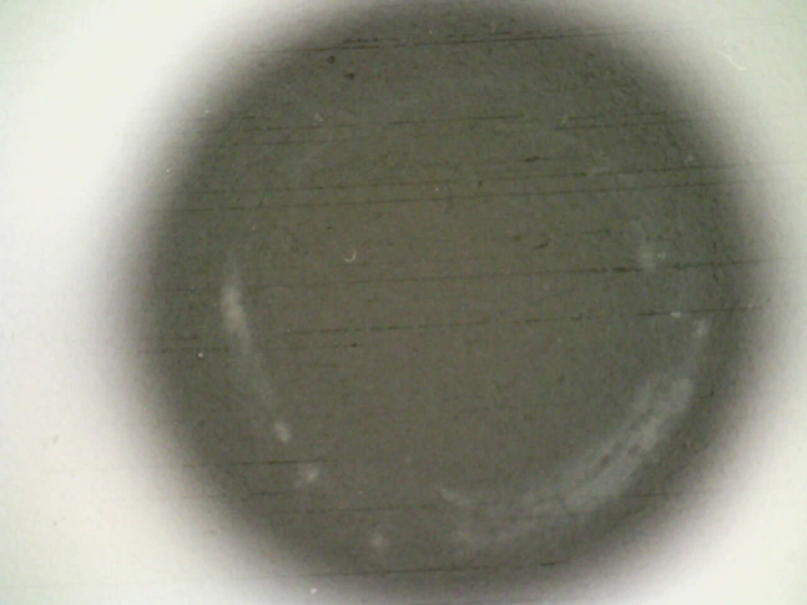
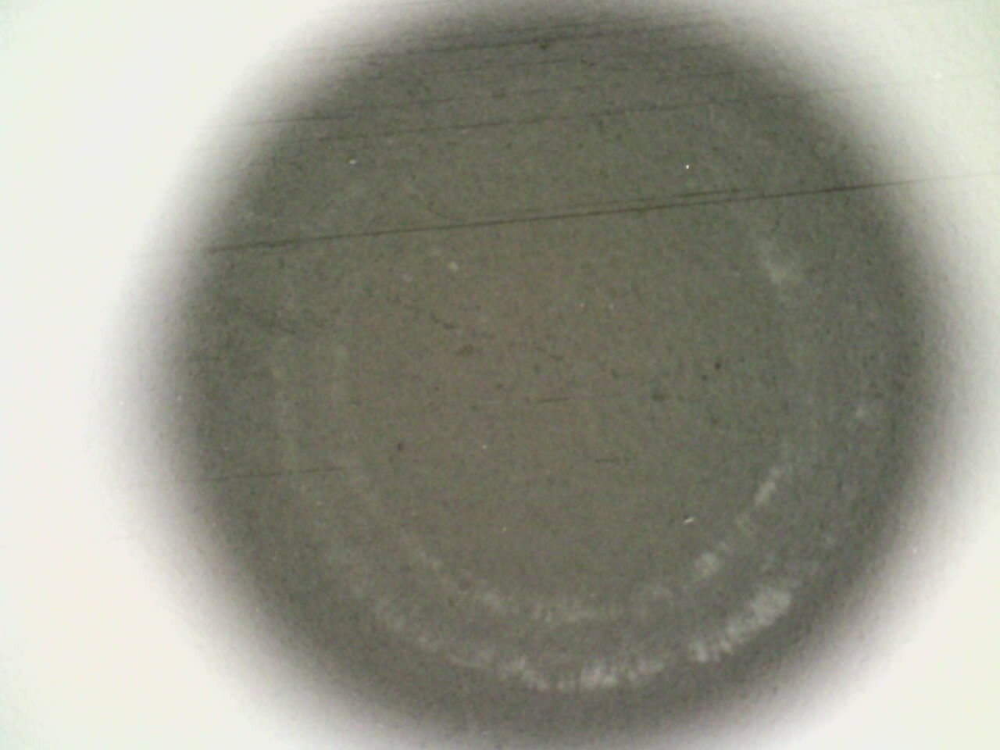
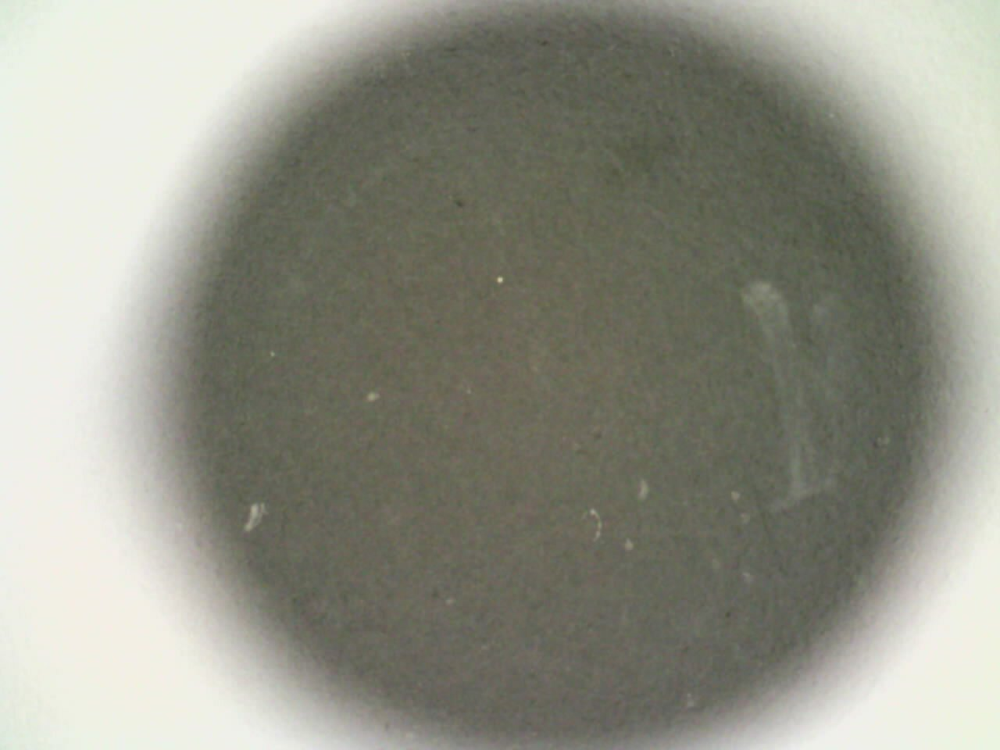
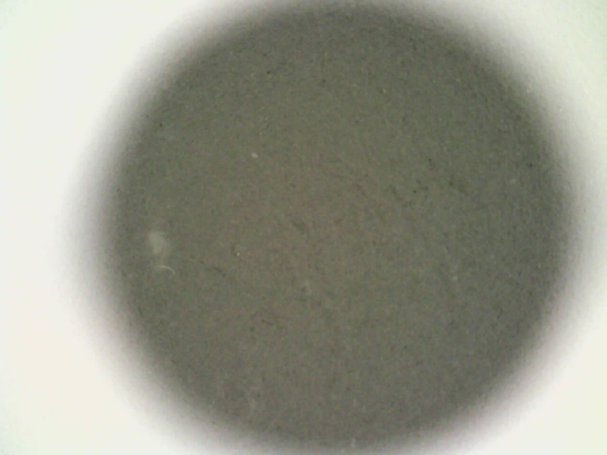
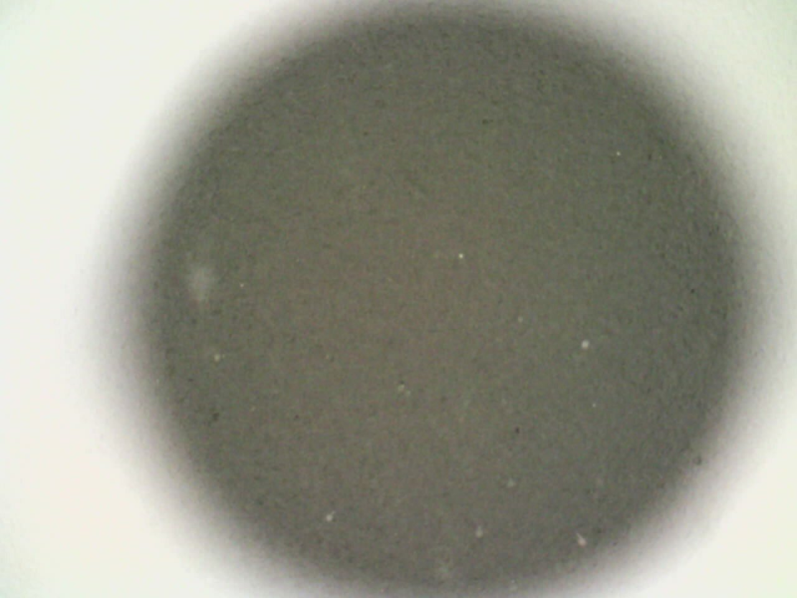

#+STARTUP: content
#+TITLE: Progress Report and Updates: 2026-04-27
#+AUTHOR: Frederick Muriuki Muriithi
#+PROPERTY: header-args:shell
#+LATEX_HEADER_EXTRA: \usepackage{svg}
#+BIBLIOGRAPHY: references.bib
#+CITE_EXPORT: natbib kluwer
#+LATEX_HEADER_EXTRA: \usepackage{fontspec}
#+LATEX: \setmainfont{Liberation Serif}
#+AUTO_TANGLE: t
#+OPTIONS: ^:{}

* Integration

** Handle Residue on/from the Silicone O-Rings

*** Opentrons Heater-Shaker Module

*Question*: What happens if we start the heater-shaker running a shake, then
unplug the USB communication cable from the "control" computer but leave the
shaker powered?

*Answer*: the heater-shaker module keeps the shake going.

This is good news because it means that I can initialise the process, unplug the
USB communication cable from the "control" computer and leave the heater-shaker
running and know it will keep running until I either explicitly stop it, or
someone unplugs it from power.

I note that, while we can reconnect to the running heater-shaker after
unplugging the cable, sending the "halt shake" G-Code does not result in the
device stopping the shaking. I had to manually turn the device off to reset it.
This is a minor issue, and should not be sufficient to prevent the experiment
from proceeding.

*** Run Residue Experiments

I begin by testing what the maximum volume of liquid is, that can be shook
without spilling: For a 10mL measuring cylinder, a volume of up to 10mL
(measured via pipette) does not spill out. 200 RPM seems to be good enough to
provide some agitation of the liquid without causing any spill-over issues.

- [x] Acquire a glass slide
- [x] Smoosh a new, uncleaned o-ring against the glass slide. This will act as
  our baseline.
- [x] Put some IPA in a glass measuring cylinder
- [x] Pick a number of o-rings, and put them in the IPA
- [x] Leave the rings in the IPA and agitate/shake the cylinder gently
- [x] Pick out a ring from the IPA at the following approximate times:
  - [x] 1 minute
  - [x] 10 minutes
  - [x] 30 minutes
  - [x] 1 hour
  - [x] 2 hours
- [x] Inspect each o-ring and record its appearance
  - [-] Take photo
  - [x] Describe appearance
- [x] Smoosh the O-ring against the glass slide
- [x] Inspect glass slide under a microscope to see whether there's any relative
  change in the amount of residue

The o-rings after cleaning are as shown in the  image below:

#+NAME:20260427-silicone-orings-residue-test
#+CAPTION: Cleaning Silicone O-Rings with Isopropyl Alcohol (IPA): The o-rings are as follows, (0) uncleaned, (1) cleaned for 1 minute, (2) cleaned for 10 minutes, (3) cleaned for 30 minutes, (4) Cleaned for 56 minutes, (5) cleaned for 120 minutes.
[[file:static/20260427_silicone_orings_residue_test_annotated.png]]

**** Uncleaned O-Ring

- No obviously visible residue with the naked eye on the glass

**** 1 minute

- No obvious size difference from uncleaned o-ring
- Still as springy as the uncleaned o-ring
- After settling for a while, we see a faint outline of the silicone O-ring with
  the naked eye on the slide.

**** 10 minutes

- No obvious size difference from the 1 minute o-ring.
- Still as springy as the other o-rings
- After settling for a while, we see an outline of the silicone O-ring with the
  naked eye on the slide.

**** 30 minutes

- No obvious size difference
- Still as springy as the other o-rings
- No obvious outline of silicone O-ring on the glass, event after quite a while.

**** 1 hour (really 56 minutes)

- No obvious size difference
- Still as springy as the other o-rings
- No obvious outline of silicone O-ring on the glass, even after quite a while

**** 2 hours

- No obvious size difference
- Still as springy as the other o-rings
- No obvious outline of silicone O-ring on the glass, even after quite a while

*** Conclusions

The silicone o-rings seem fairly resistant to the IPA, in that they do not seem
to deform even after leaving them soaking for up to 2 hours.

They also, generally seem to be relatively clean, (i.e. not much residue). It is
possible that some of the residue we observe came from handling.

Overall, it seems like there is, generally speaking, no harm in rinsing the
silicone o-rings in IPA before using them with the GFET.
