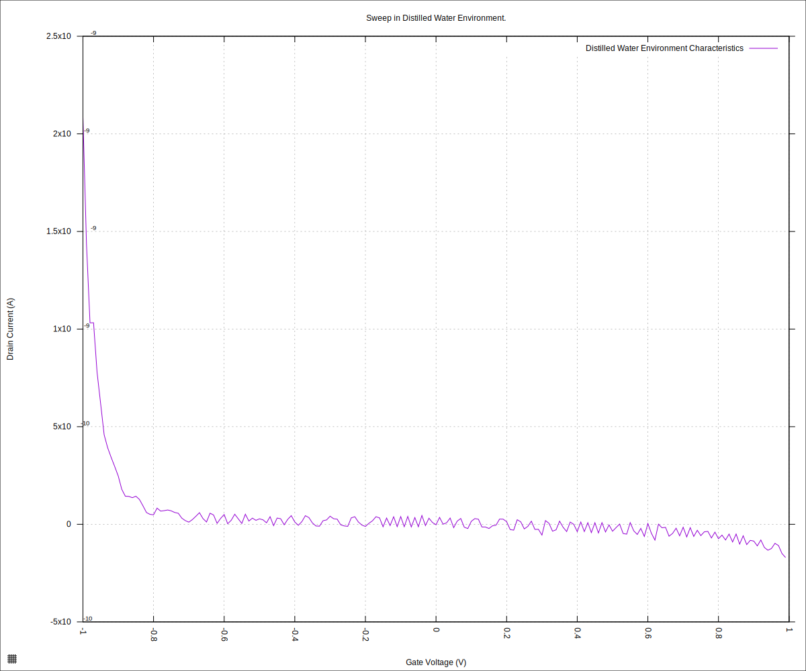
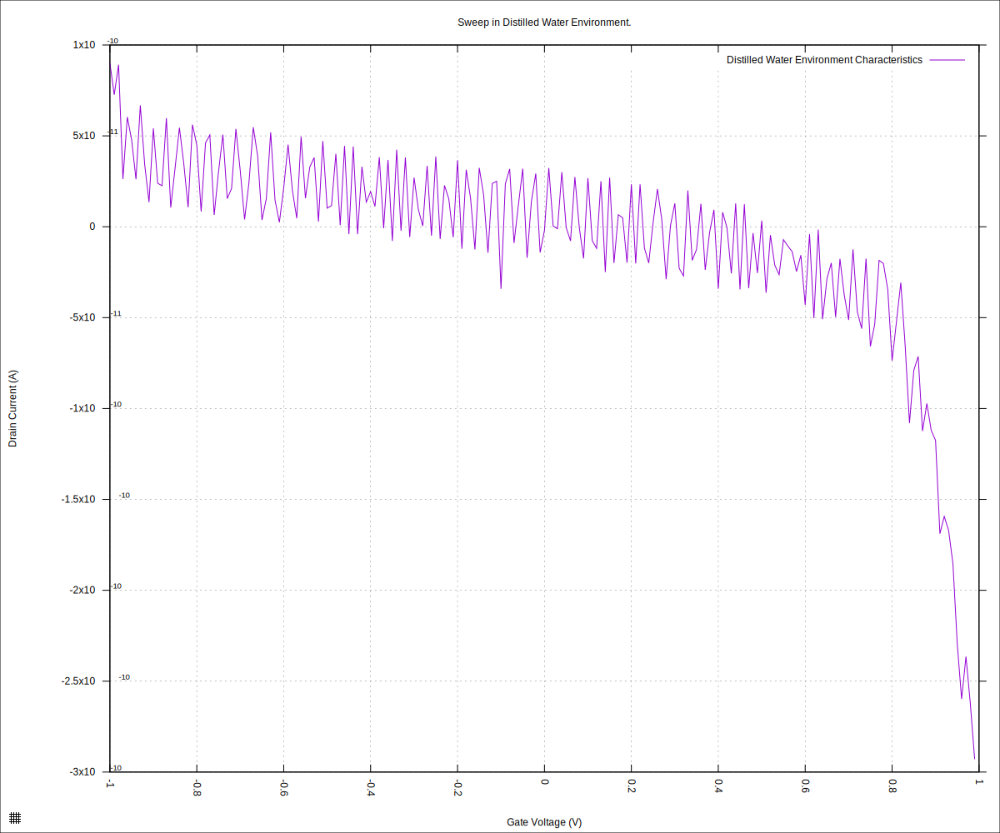
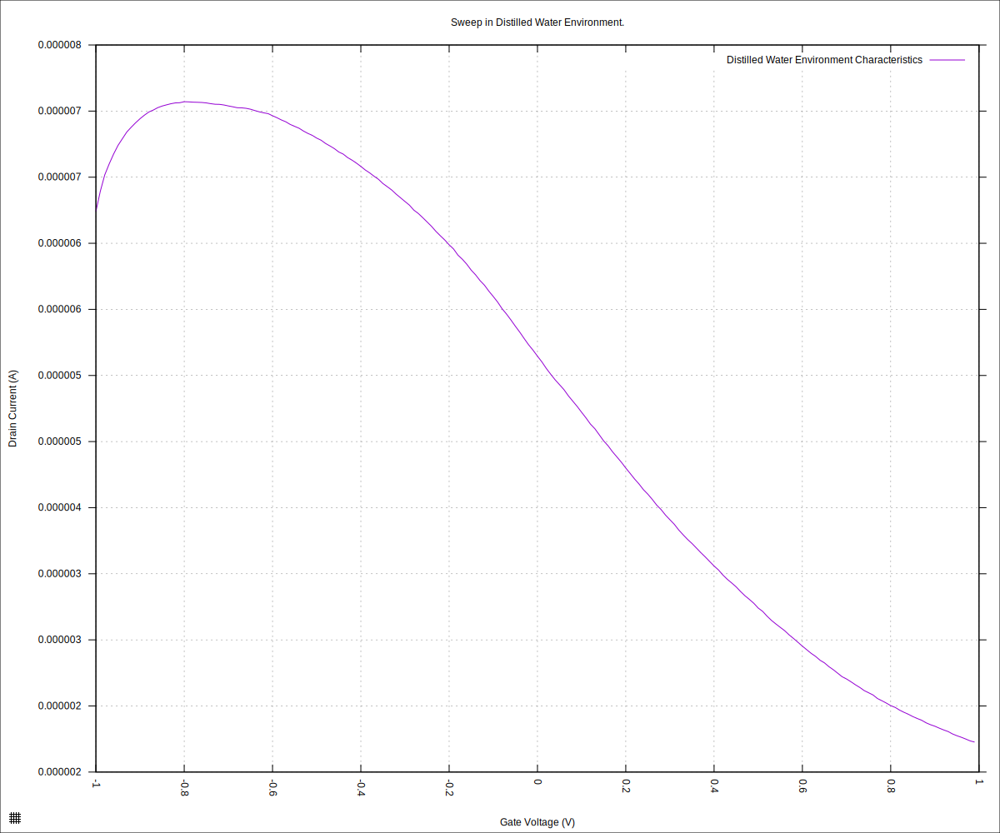
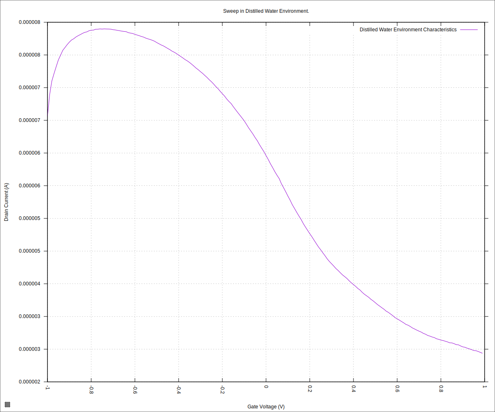

#+STARTUP: content
#+TITLE: Progress Report and Updates: 2026-05-19
#+AUTHOR: Frederick Muriuki Muriithi
#+PROPERTY: header-args:shell
#+LATEX_HEADER_EXTRA: \usepackage{svg}
#+BIBLIOGRAPHY: references.bib
#+CITE_EXPORT: natbib kluwer
#+LATEX_HEADER_EXTRA: \usepackage{fontspec}
#+LATEX: \setmainfont{Liberation Serif}
#+AUTO_TANGLE: t
#+OPTIONS: ^:{}

* Integration

** Verify Operations

*** Basic Sweep

We have verified the operation of the basic parts of the system, and can now
proceed to testing the whole. The plan, moving forward, is to run the full
validation script to see whether we can identify any leftover issues.

We'll begin by initialising the microfluidics device,

#+begin_src shell
  python3 fluid_detection.py \
          initialise-microfluidics-device \
          --microfluidics-serial-port /dev/ttyACM0
#+end_src

Now that the device is initialised, we push pure distilled water through the
GFET line until we get some on the waste/collection line.

#+begin_src shell
  stty -F /dev/ttyACM0 9600
  echo "WASH COLLECTION 0 -T 60 -R 36" > /dev/ttyACM0;
#+end_src

Do a sweep, which we will use to verify basic operation of the entire assembly.

#+begin_src shell
  python3 sweep.py \
          --log-level debug \
          --smu-visa-address ASRL/dev/ttyUSB0::INSTR \
          --line-frequency 60 \
          --nplc 12.5005 \
          --gate_voltage 1.0 \
          --sweep_interval 0.01 \
          --channel-voltage 0.05 \
          --raise-keithley-errors \
          > "fd-test-01/$(date +'%Y%m%d')/$(date +'%Y%m%d')-001-water-readings.csv" \
          2> "fd-test-01/$(date +'%Y%m%d')/$(date +'%Y%m%d')-001-water-events.txt"
#+end_src

We can now process the data,

#+begin_src shell
  python3 isswisafre.py process-data \
          "fd-test-01/$(date +'%Y%m%d')/$(date +'%Y%m%d')-001-water-readings.csv" \
          "fd-test-01/$(date +'%Y%m%d')/"
#+end_src

and generate (a) plot(s)

#+begin_src gnuplot :tangle ./20260519-001-water-readings.gp
  load "./20260220-plotting-styles.gp"

  set output "./static/20260519-001-water-readings-positive.svg"

  set title "Sweep in Distilled Water Environment."
  set xlabel "Gate Voltage (V)"
  set ylabel "Drain Current (A)"
  set datafile separator ","
  plot \
       "./static/20260519-001-water-readings_positive.csv" \
       using "measured_gate_voltage":"drain_current" \
       title "Distilled Water Environment Characteristics" \
       with lines
#+end_src

which gives us the following plot

#+CAPTION: 2026-05-19: Distilled water characteristics using new flowcell from Protolabs. Attempt 001.
#+NAME: 20260519-001-water-readings-positive

The plot is worrying... did we break the new chip already?

Let's check by disassembling the cartridge and using the drop-type reservoir.
Start by purging the fluid lines.

#+begin_src shell
  python3 fluid_detection.py \
          reset-microfluidics-device \
          --microfluidics-serial-port /dev/ttyACM0
#+end_src

While disassembling, one of the pogo-pins banks came apart. Put it back together
and continue.

After reassembling the cartridge and connecting it to the SMU, we put a drop of
pure distilled water in the reservoir and run a sweep.

#+begin_src shell
  python3 sweep.py \
          --log-level debug \
          --smu-visa-address ASRL/dev/ttyUSB0::INSTR \
          --line-frequency 60 \
          --nplc 12.5005 \
          --gate_voltage 1.0 \
          --sweep_interval 0.01 \
          --channel-voltage 0.05 \
          --raise-keithley-errors \
          > "fd-test-01/$(date +'%Y%m%d')/$(date +'%Y%m%d')-002-water-readings.csv" \
          2> "fd-test-01/$(date +'%Y%m%d')/$(date +'%Y%m%d')-002-water-events.txt" && \
      python3 isswisafre.py process-data \
              "fd-test-01/$(date +'%Y%m%d')/$(date +'%Y%m%d')-002-water-readings.csv" \
              "fd-test-01/$(date +'%Y%m%d')/"
#+end_src

... and plotting ...

#+begin_src gnuplot :tangle ./20260519-002-water-readings.gp
  load "./20260220-plotting-styles.gp"

  set output "./static/20260519-002-water-readings-positive.svg"

  set title "Sweep in Distilled Water Environment."
  set xlabel "Gate Voltage (V)"
  set ylabel "Drain Current (A)"
  set datafile separator ","
  plot \
       "./static/20260519-002-water-readings_positive.csv" \
       using "measured_gate_voltage":"drain_current" \
       title "Distilled Water Environment Characteristics" \
       with lines
#+end_src

... we get

#+CAPTION: Distilled water characteristics using new chip with drop-type reservoir after restoring the broken pogo-pins' bank.
#+NAME: 20260519-002-water-readings-positive

which does not bode well.

The plots look very much like those in the previously broken chips (╯°□°)╯︵ ┻━┻.

For good measure, let's us try changing the side of the cartridge in use, and
the channel of the chip in use.

#+begin_src shell
  python3 sweep.py \
          --log-level debug \
          --smu-visa-address ASRL/dev/ttyUSB0::INSTR \
          --line-frequency 60 \
          --nplc 12.5005 \
          --gate_voltage 1.0 \
          --sweep_interval 0.01 \
          --channel-voltage 0.05 \
          --raise-keithley-errors \
          > "fd-test-01/$(date +'%Y%m%d')/$(date +'%Y%m%d')-003-water-readings.csv" \
          2> "fd-test-01/$(date +'%Y%m%d')/$(date +'%Y%m%d')-003-water-events.txt" && \
      python3 isswisafre.py process-data \
              "fd-test-01/$(date +'%Y%m%d')/$(date +'%Y%m%d')-003-water-readings.csv" \
              "fd-test-01/$(date +'%Y%m%d')/"
#+end_src

and generating the plot

#+begin_src gnuplot :tangle ./20260519-003-water-readings.gp
  load "./20260220-plotting-styles.gp"

  set output "./static/20260519-003-water-readings-positive.svg"

  set title "Sweep in Distilled Water Environment."
  set xlabel "Gate Voltage (V)"
  set ylabel "Drain Current (A)"
  set datafile separator ","
  plot \
       "./static/20260519-003-water-readings_positive.csv" \
       using "measured_gate_voltage":"drain_current" \
       title "Distilled Water Environment Characteristics" \
       with lines
#+end_src

we get

#+CAPTION: Distilled water characteristics after changing the side of the cartridge, and the chip-channel connected to the SMU.
#+NAME: 20260519-003-water-readings-positive

This plot indicates that the chip might be fine, albeit with the Dirac point being slightly outside the usual range.

Next, we restore the flowcell-type reservoir, and test with this
"known-to-be-okay" chip channel. We expect a similar plot in that case too.

Initialise the microfluidics device again and ensure there's water on the GFET
line.

#+begin_src shell
  python3 fluid_detection.py \
          initialise-microfluidics-device \
          --microfluidics-serial-port /dev/ttyACM0 && \
      echo "WASH COLLECTION 0 -T 60 -R 36" > /dev/ttyACM0;
#+end_src

Run the sweep and process the data for plotting.

#+begin_src shell
  python3 sweep.py \
          --log-level debug \
          --smu-visa-address ASRL/dev/ttyUSB0::INSTR \
          --line-frequency 60 \
          --nplc 12.5005 \
          --gate_voltage 1.0 \
          --sweep_interval 0.01 \
          --channel-voltage 0.05 \
          --raise-keithley-errors \
          > "fd-test-01/$(date +'%Y%m%d')/$(date +'%Y%m%d')-004-water-readings.csv" \
          2> "fd-test-01/$(date +'%Y%m%d')/$(date +'%Y%m%d')-004-water-events.txt" &&
      python3 isswisafre.py process-data \
              "fd-test-01/$(date +'%Y%m%d')/$(date +'%Y%m%d')-004-water-readings.csv" \
              "fd-test-01/$(date +'%Y%m%d')/"
#+end_src

Plotting the data

#+begin_src gnuplot :tangle ./20260519-004-water-readings.gp
  load "./20260220-plotting-styles.gp"

  set output "./static/20260519-004-water-readings-positive.svg"

  set title "Sweep in Distilled Water Environment."
  set xlabel "Gate Voltage (V)"
  set ylabel "Drain Current (A)"
  set datafile separator ","
  plot \
       "./static/20260519-004-water-readings_positive.csv" \
       using "measured_gate_voltage":"drain_current" \
       title "Distilled Water Environment Characteristics" \
       with lines
#+end_src

and the plot is

#+CAPTION: Distilled water characteristics with flowcell-type reservoir and known-to-be-okay chip channel.
#+NAME: 20260519-004-water-readings-positive

Wooot!! 🎉 It looks pretty much like the one with the drop-type reservoir.

This bodes well for the project.

I think the likely reason for the previously weird results is a failing or loose
connection - keeping in mind the pogo pins came off.
