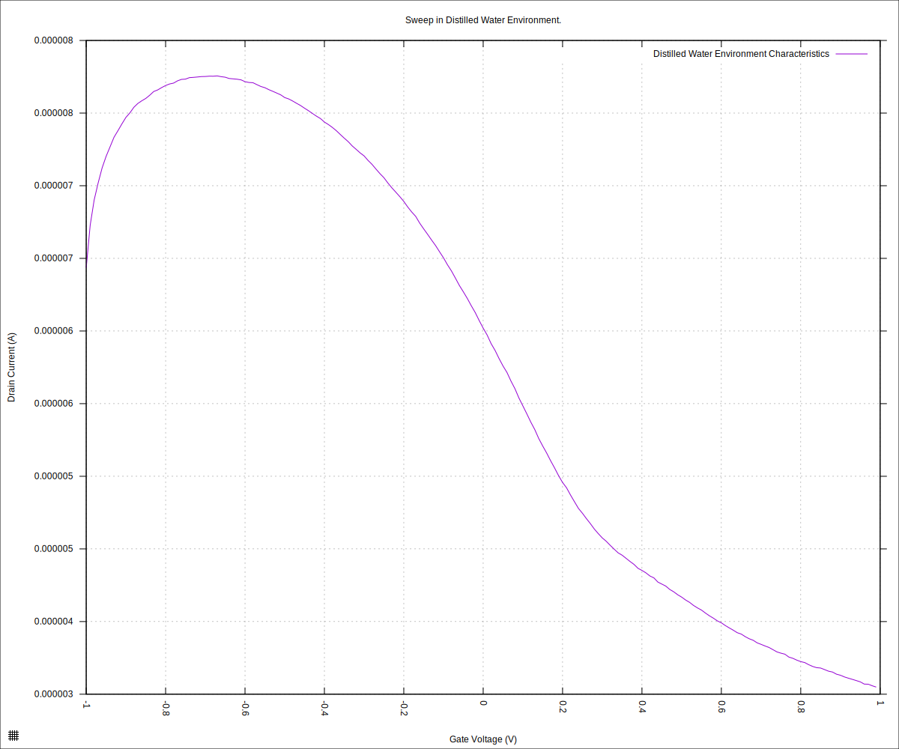
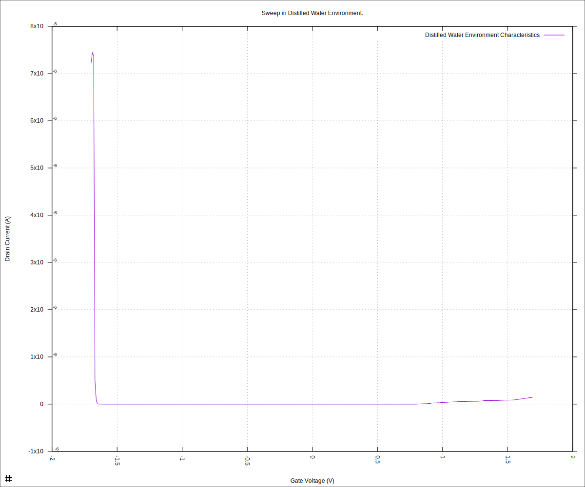
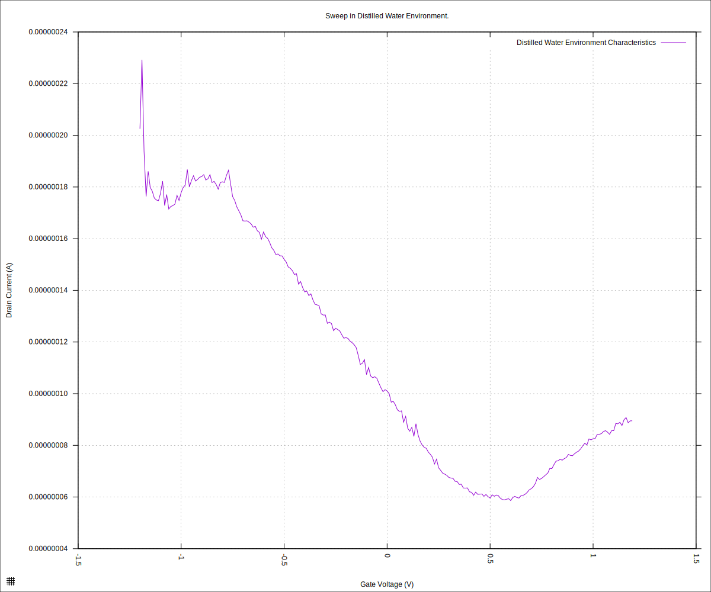

#+STARTUP: content
#+TITLE: Progress Report and Updates: 2026-05-22
#+AUTHOR: Frederick Muriuki Muriithi
#+PROPERTY: header-args:shell
#+LATEX_HEADER_EXTRA: \usepackage{svg}
#+BIBLIOGRAPHY: references.bib
#+CITE_EXPORT: natbib kluwer
#+LATEX_HEADER_EXTRA: \usepackage{fontspec}
#+LATEX: \setmainfont{Liberation Serif}
#+AUTO_TANGLE: t
#+OPTIONS: ^:{}

* Integration

** Verify Operations

On Tuesday, 2026-05-19, we did a "quick and dirty" verification that the system
is mostly working as expected. We noted that the plots approximate the shape
expected in a normal sweep, other than the Dirac point being completely out of
the range of the sweep.

We followed that up by immersing the chip in acetone and leaving it overnight.
The following day, we took it out of the acetone bath and rinsed it off  with
isopropyl alcohol (IPA) before storing it in a vacuum.

Today, we took the chip out from storage and put it into the cartridge and run
the same sweeps we did last time to see whether or not the cleaning has pulled
the Dirac point back within the expected range.

We begin by initialising the microfluidics device, and ensuring the GFET line
has liquid (in this case, ultrapure distilled water - the same liquid we've been
using since the beginning).

#+begin_src shell
  python3 fluid_detection.py \
          initialise-microfluidics-device \
          --microfluidics-serial-port /dev/ttyACM0
  stty -F /dev/ttyACM0 9600
  echo "WASH COLLECTION 0 -T 60 -R 36" > /dev/ttyACM0
#+end_src

That done, we can now do an actual sweep to get new data.

#+begin_src shell
  mkdir -pv "fd-test-01/$(date +'%Y%m%d')" && \
      python3 sweep.py \
              --log-level debug \
              --smu-visa-address ASRL/dev/ttyUSB0::INSTR \
              --line-frequency 60 \
              --nplc 12.5005 \
              --gate_voltage 1.0 \
              --sweep_interval 0.01 \
              --channel-voltage 0.05 \
              --raise-keithley-errors \
              > "fd-test-01/$(date +'%Y%m%d')/$(date +'%Y%m%d')-001-water-readings.csv" \
              2> "fd-test-01/$(date +'%Y%m%d')/$(date +'%Y%m%d')-001-water-events.txt" && \
      python3 isswisafre.py process-data \
              "fd-test-01/$(date +'%Y%m%d')/$(date +'%Y%m%d')-001-water-readings.csv" \
              "fd-test-01/$(date +'%Y%m%d')/"
#+end_src

At this point, we can now plot the data to see how the curve(s) look.

#+begin_src gnuplot :tangle ./20260522-001-water-readings.gp
  load "./20260220-plotting-styles.gp"

  set output "./static/20260522-001-water-readings-positive.svg"

  set title "Sweep in Distilled Water Environment."
  set xlabel "Gate Voltage (V)"
  set ylabel "Drain Current (A)"
  set datafile separator ","
  plot \
       "./static/20260522-001-water-readings_positive.csv" \
       using "measured_gate_voltage":"drain_current" \
       title "Distilled Water Environment Characteristics" \
       with lines
#+end_src

#+CAPTION: Chip characteristics with distilled water after cleaning the chip by immersing it in an acetone bath overnight and rinsing with IPA.
#+NAME: 20260522-001-water-readings-positive

We see from this that the plot is consistent, with the dirac point having been
shifted way past the usual point of around +0.5V.

Let us try making the sweep range larger (I had to do a temporary modification
to the code to allow this).

#+begin_src shell
  python3 sweep.py \
          --log-level debug \
          --smu-visa-address ASRL/dev/ttyUSB0::INSTR \
          --line-frequency 60 \
          --nplc 12.5005 \
          --gate_voltage 1.7 \
          --sweep_interval 0.01 \
          --channel-voltage 0.05 \
          --raise-keithley-errors \
          > "fd-test-01/$(date +'%Y%m%d')/$(date +'%Y%m%d')-002-water-readings.csv" \
          2> "fd-test-01/$(date +'%Y%m%d')/$(date +'%Y%m%d')-002-water-events.txt" && \
      python3 isswisafre.py process-data \
              "fd-test-01/$(date +'%Y%m%d')/$(date +'%Y%m%d')-002-water-readings.csv" \
              "fd-test-01/$(date +'%Y%m%d')/"
#+end_src

and plotting

#+begin_src gnuplot :tangle ./20260522-002-water-readings.gp
  load "./20260220-plotting-styles.gp"

  set output "./static/20260522-002-water-readings-positive.svg"

  set title "Sweep in Distilled Water Environment."
  set xlabel "Gate Voltage (V)"
  set ylabel "Drain Current (A)"
  set datafile separator ","
  plot \
       "./static/20260522-002-water-readings_positive.csv" \
       using "measured_gate_voltage":"drain_current" \
       title "Distilled Water Environment Characteristics" \
       with lines
#+end_src

we get

#+CAPTION: Chip characteristics with distilled water after extending the range to -1.7V to +1.7V.
#+NAME: 20260522-002-water-readings-positive

Okay, maybe 1.7V is too far. Let's try 1.2V.

#+begin_src shell
  python3 sweep.py \
          --log-level debug \
          --smu-visa-address ASRL/dev/ttyUSB0::INSTR \
          --line-frequency 60 \
          --nplc 12.5005 \
          --gate_voltage 1.2 \
          --sweep_interval 0.01 \
          --channel-voltage 0.05 \
          --raise-keithley-errors \
          > "fd-test-01/$(date +'%Y%m%d')/$(date +'%Y%m%d')-003-water-readings.csv" \
          2> "fd-test-01/$(date +'%Y%m%d')/$(date +'%Y%m%d')-003-water-events.txt" && \
      python3 isswisafre.py process-data \
              "fd-test-01/$(date +'%Y%m%d')/$(date +'%Y%m%d')-003-water-readings.csv" \
              "fd-test-01/$(date +'%Y%m%d')/"
#+end_src

and plotting

#+begin_src gnuplot :tangle ./20260522-003-water-readings.gp
  load "./20260220-plotting-styles.gp"

  set output "./static/20260522-003-water-readings-positive.svg"

  set title "Sweep in Distilled Water Environment."
  set xlabel "Gate Voltage (V)"
  set ylabel "Drain Current (A)"
  set datafile separator ","
  plot \
       "./static/20260522-003-water-readings_positive.csv" \
       using "measured_gate_voltage":"drain_current" \
       title "Distilled Water Environment Characteristics" \
       with lines
#+end_src

we get

#+CAPTION: Chip characteristics with distilled water after extending the range to -1.2V to +1.2V.
#+NAME: 20260522-003-water-readings-positive

We see a turn-around at about 0.5V, as would be expected normally. I am, however,
loath to make a conclusion that the system is working fine, as of yet.

The over-voltage to 1.7V seemed to have destabilised the chip (we no longer seem
to be getting smooth curves), and while the turn-around is about where we expect,
it could all just be a figment of my hopes and dreams 😭.

I will need to verify this another day - for now, I'll soak the chip in acetone
and rinse it off later. Start by resetting the device.

#+begin_src shell
  python3 fluid_detection.py \
          reset-microfluidics-device \
          --microfluidics-serial-port /dev/ttyACM0
#+end_src

Now we can leave the chip submerged in an acetone bath overnight.
