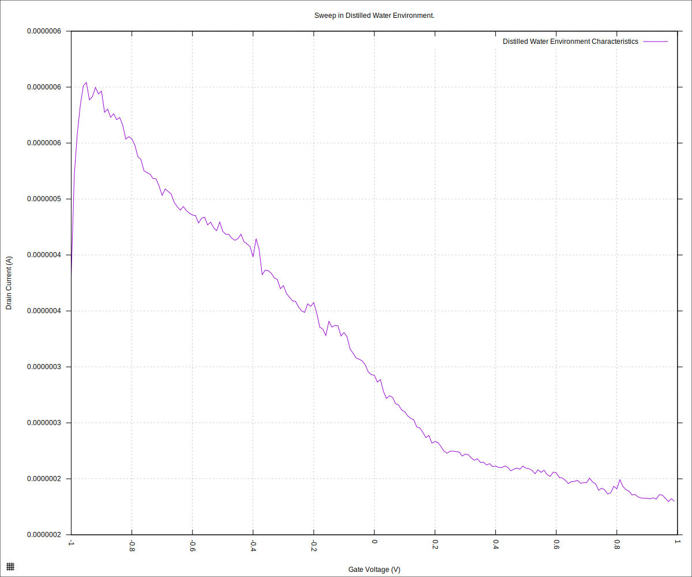
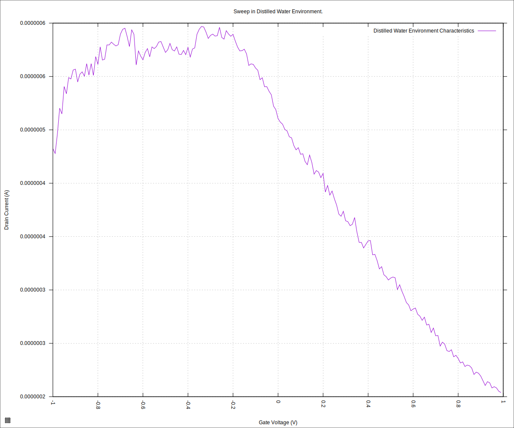
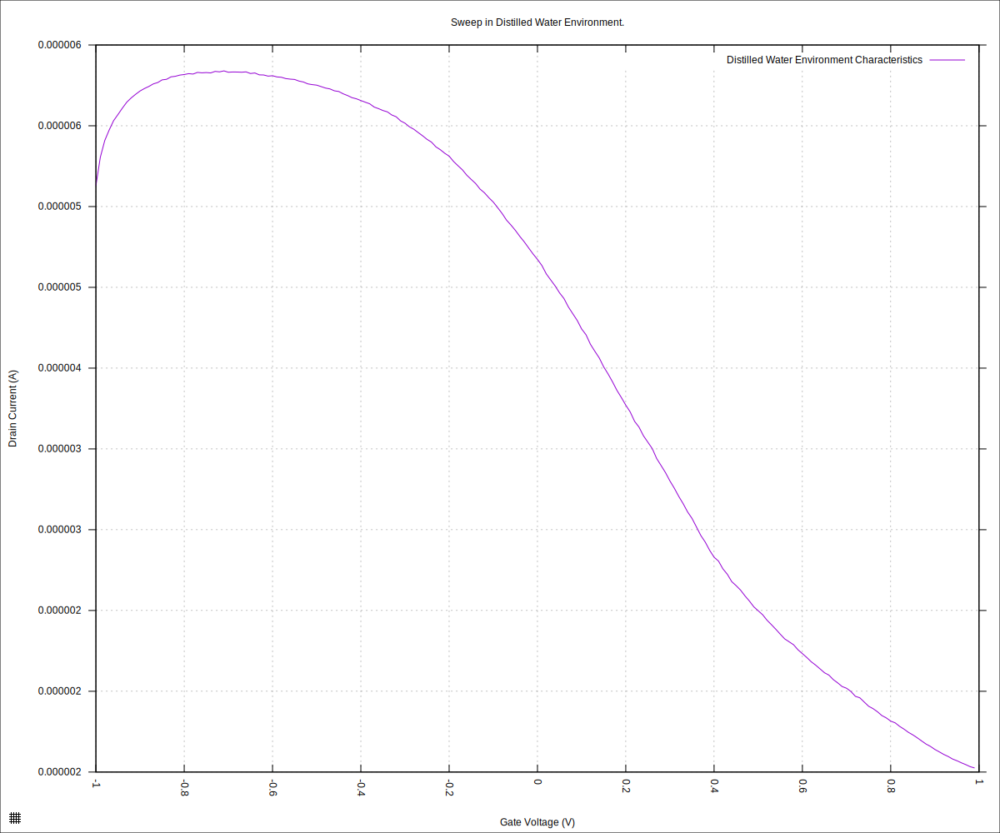

#+STARTUP: content
#+TITLE: Progress Report and Updates: 2026-05-26
#+AUTHOR: Frederick Muriuki Muriithi
#+PROPERTY: header-args:shell
#+LATEX_HEADER_EXTRA: \usepackage{svg}
#+BIBLIOGRAPHY: references.bib
#+CITE_EXPORT: natbib kluwer
#+LATEX_HEADER_EXTRA: \usepackage{fontspec}
#+LATEX: \setmainfont{Liberation Serif}
#+AUTO_TANGLE: t
#+OPTIONS: ^:{}

* Integration

** Verify Operations

Last week we noted the characteristic curves had the Dirac point for the chip
falling outside our usual range. After over-voltaging the chip, there was a
promising, albeit unforeseen, development that might have got the Dirac point
within range.

Today, we run the same experiment as last time, but using the usual range of
-1.0V to +1.0V and see the results.

Begin by assembling the chip into the cartridge then initialising the
microfluidics device:

#+begin_src shell
  python3 fluid_detection.py \
          initialise-microfluidics-device \
          --microfluidics-serial-port /dev/ttyACM0
  stty -F /dev/ttyACM0 9600
  echo "WASH COLLECTION 0 -T 60 -R 36" > /dev/ttyACM0
#+end_src

then follow that up with a sweep

#+begin_src shell
  mkdir -pv "fd-test-01/$(date +'%Y%m%d')" && \
      python3 sweep.py \
              --log-level debug \
              --smu-visa-address ASRL/dev/ttyUSB0::INSTR \
              --line-frequency 60 \
              --nplc 12.5005 \
              --gate_voltage 1.0 \
              --sweep_interval 0.01 \
              --channel-voltage 0.05 \
              --raise-keithley-errors \
              > "fd-test-01/$(date +'%Y%m%d')/$(date +'%Y%m%d')-001-water-readings.csv" \
              2> "fd-test-01/$(date +'%Y%m%d')/$(date +'%Y%m%d')-001-water-events.txt" && \
      python3 isswisafre.py process-data \
              "fd-test-01/$(date +'%Y%m%d')/$(date +'%Y%m%d')-001-water-readings.csv" \
              "fd-test-01/$(date +'%Y%m%d')/"
#+end_src

and generate the first plot for the day

#+begin_src gnuplot :tangle ./20260526-001-water-readings.gp
  load "./20260220-plotting-styles.gp"

  set output "./static/20260526-001-water-readings-positive.svg"

  set title "Sweep in Distilled Water Environment."
  set xlabel "Gate Voltage (V)"
  set ylabel "Drain Current (A)"
  set datafile separator ","
  plot \
       "./static/20260526-001-water-readings_positive.csv" \
       using "measured_gate_voltage":"drain_current" \
       title "Distilled Water Environment Characteristics" \
       with lines
#+end_src

the plot does not look good. 

#+CAPTION: Chip Characteristics with Distilled Water after Over-Voltage and Cleaning
#+NAME: 20260526-001-water-readings-positive

It looks like the over-voltage broke something irredeemably.

Let's try a different channel/line on the chip -- switch the drain-source channel
used on the chip from 3 to say, 4.

Run the sweep again.

#+begin_src shell
  python3 sweep.py \
          --log-level debug \
          --smu-visa-address ASRL/dev/ttyUSB0::INSTR \
          --line-frequency 60 \
          --nplc 12.5005 \
          --gate_voltage 1.0 \
          --sweep_interval 0.01 \
          --channel-voltage 0.05 \
          --raise-keithley-errors \
          > "fd-test-01/$(date +'%Y%m%d')/$(date +'%Y%m%d')-002-water-readings.csv" \
          2> "fd-test-01/$(date +'%Y%m%d')/$(date +'%Y%m%d')-002-water-events.txt" && \
      python3 isswisafre.py process-data \
              "fd-test-01/$(date +'%Y%m%d')/$(date +'%Y%m%d')-002-water-readings.csv" \
              "fd-test-01/$(date +'%Y%m%d')/"
#+end_src

and plotting

#+begin_src gnuplot :tangle ./20260526-002-water-readings.gp
  load "./20260220-plotting-styles.gp"

  set output "./static/20260526-002-water-readings-positive.svg"

  set title "Sweep in Distilled Water Environment."
  set xlabel "Gate Voltage (V)"
  set ylabel "Drain Current (A)"
  set datafile separator ","
  plot \
       "./static/20260526-002-water-readings_positive.csv" \
       using "measured_gate_voltage":"drain_current" \
       title "Distilled Water Environment Characteristics" \
       with lines
#+end_src

we get

#+CAPTION: Chip Characteristics with Distilled Water after Switching to drain-source channel 04 on the chip.
#+NAME: 20260526-002-water-readings-positive

Switch the cartride/chip side in use

#+begin_src shell
  python3 sweep.py \
          --log-level debug \
          --smu-visa-address ASRL/dev/ttyUSB0::INSTR \
          --line-frequency 60 \
          --nplc 12.5005 \
          --gate_voltage 1.0 \
          --sweep_interval 0.01 \
          --channel-voltage 0.05 \
          --raise-keithley-errors \
          > "fd-test-01/$(date +'%Y%m%d')/$(date +'%Y%m%d')-003-water-readings.csv" \
          2> "fd-test-01/$(date +'%Y%m%d')/$(date +'%Y%m%d')-003-water-events.txt" && \
      python3 isswisafre.py process-data \
              "fd-test-01/$(date +'%Y%m%d')/$(date +'%Y%m%d')-003-water-readings.csv" \
              "fd-test-01/$(date +'%Y%m%d')/"
#+end_src

and plotting

#+begin_src gnuplot :tangle ./20260526-003-water-readings.gp
  load "./20260220-plotting-styles.gp"

  set output "./static/20260526-003-water-readings-positive.svg"

  set title "Sweep in Distilled Water Environment."
  set xlabel "Gate Voltage (V)"
  set ylabel "Drain Current (A)"
  set datafile separator ","
  plot \
       "./static/20260526-003-water-readings_positive.csv" \
       using "measured_gate_voltage":"drain_current" \
       title "Distilled Water Environment Characteristics" \
       with lines
#+end_src

we get

#+CAPTION: Chip Characteristics with distilled-water after switching to side A of the cartridge.
#+NAME: 20260526-003-water-readings-positive

which is a much better curve, but just like before, the dirac point seems to be past the usual [-1.0V, +1.0V) range.
