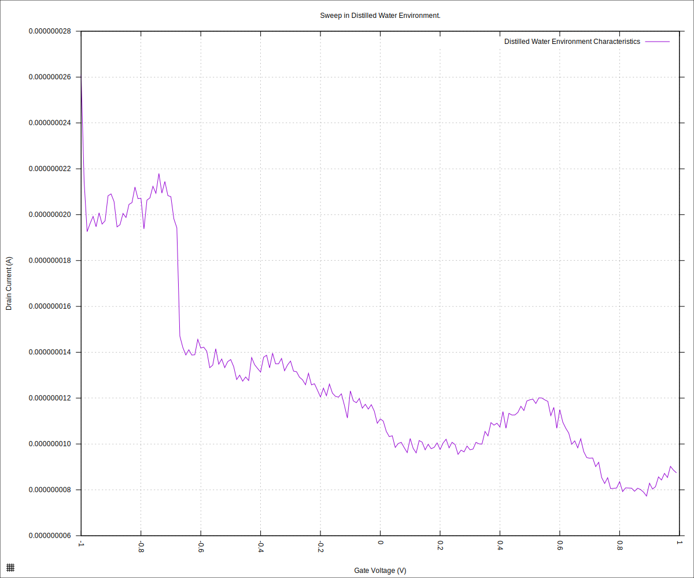
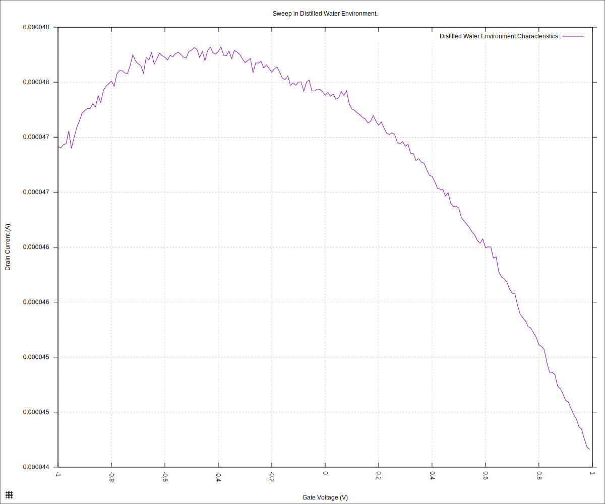
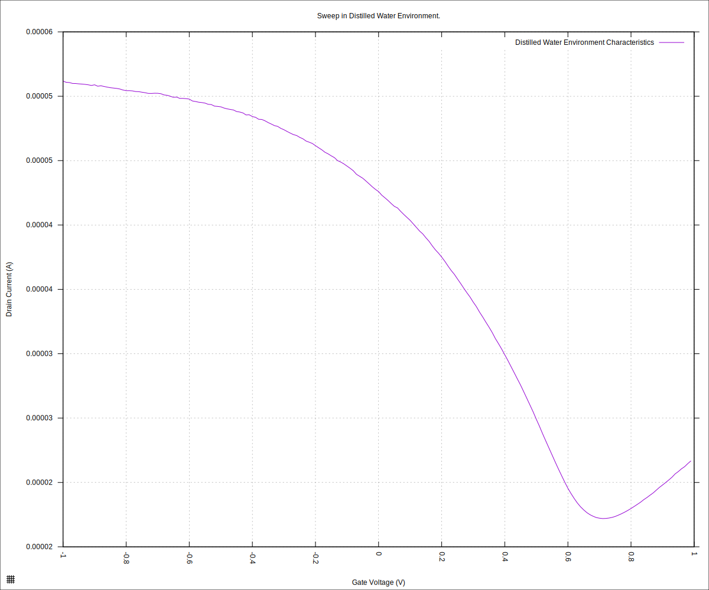
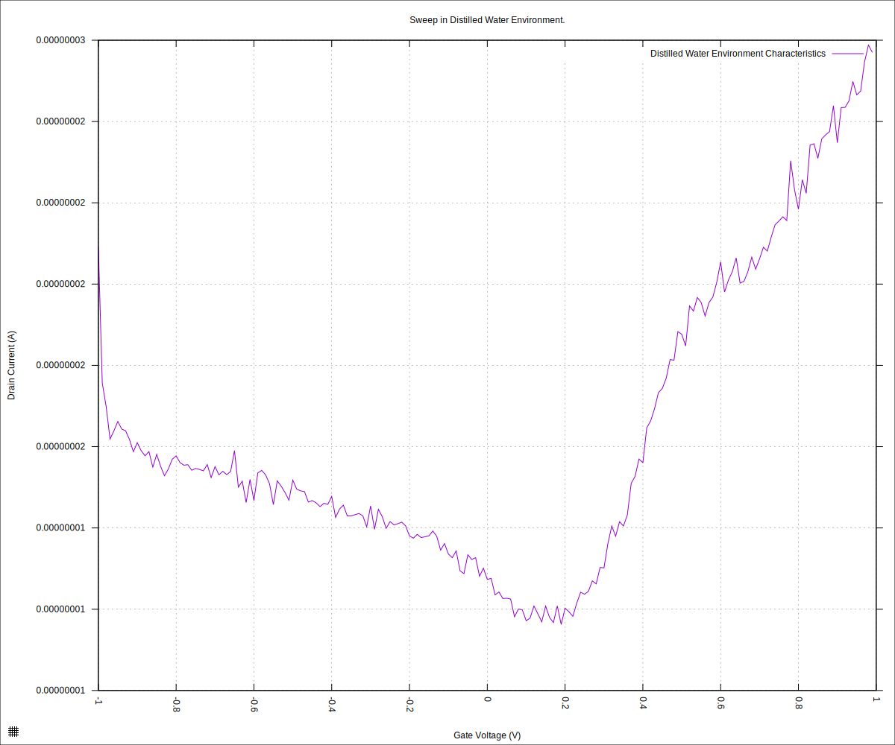
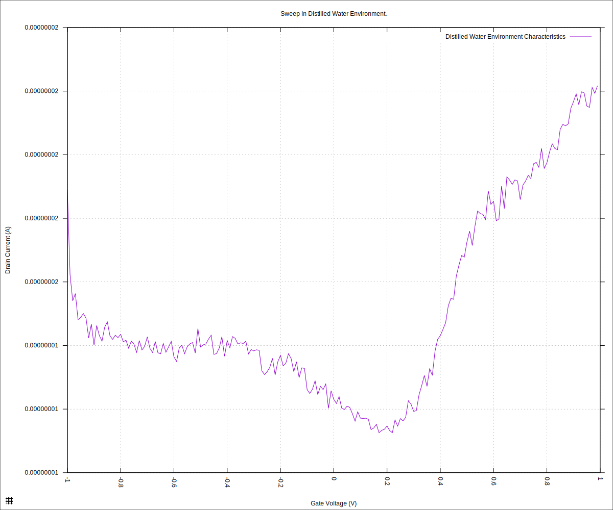

#+STARTUP: content
#+TITLE: Progress Report and Updates: 2026-06-01
#+AUTHOR: Frederick Muriuki Muriithi
#+PROPERTY: header-args:shell
#+LATEX_HEADER_EXTRA: \usepackage{svg}
#+BIBLIOGRAPHY: references.bib
#+CITE_EXPORT: natbib kluwer
#+LATEX_HEADER_EXTRA: \usepackage{fontspec}
#+LATEX: \setmainfont{Liberation Serif}
#+AUTO_TANGLE: t
#+OPTIONS: ^:{}

* Integration

** Verify Chip

We begin today's verification by breaking out new, previously unused chip. We will use this new chip to check some baseline assumptions/expectations of the system.

The first verification will be done with ultra-pure distilled water and the drop-type reservoir. We run the sweep against that.

#+begin_src shell
  mkdir -pv "fd-test-01/$(date +'%Y%m%d')" && \
      python3 sweep.py \
              --log-level debug \
              --smu-visa-address ASRL/dev/ttyUSB0::INSTR \
              --line-frequency 60 \
              --nplc 12.5005 \
              --gate_voltage 1.0 \
              --sweep_interval 0.01 \
              --channel-voltage 0.05 \
              --raise-keithley-errors \
              > "fd-test-01/$(date +'%Y%m%d')/$(date +'%Y%m%d')-001-water-readings.csv" \
              2> "fd-test-01/$(date +'%Y%m%d')/$(date +'%Y%m%d')-001-water-events.txt" && \
      python3 isswisafre.py process-data \
              "fd-test-01/$(date +'%Y%m%d')/$(date +'%Y%m%d')-001-water-readings.csv" \
              "fd-test-01/$(date +'%Y%m%d')/"
#+end_src

and generate the plot for the resulting data

#+begin_src gnuplot :tangle ./20260601-001-water-readings.gp
  load "./20260220-plotting-styles.gp"

  set output "./static/20260601-001-water-readings-positive.svg"

  set title "Sweep in Distilled Water Environment."
  set xlabel "Gate Voltage (V)"
  set ylabel "Drain Current (A)"
  set datafile separator ","
  plot \
       "./static/20260601-001-water-readings_positive.csv" \
       using "measured_gate_voltage":"drain_current" \
       title "Distilled Water Environment Characteristics" \
       with lines
#+end_src

which gives us the plot below

#+CAPTION: Chip characteristics with ultra-pure distilled water on a completely new chip (2026-06-01) with the drop-type reservoir. The purpose of this run is to verify basic working of the chip before running the experiment with the flowcell type reservoir.
#+NAME: 20260601-001-water-readings-positive

This plot indicates that there is definitely something going wrong with the setup. The new, previously unused chip is showing unexpected behaviour.

Switching from side A to side B of the cartridge, without changing anything else:

#+begin_src shell
  python3 sweep.py \
          --log-level debug \
          --smu-visa-address ASRL/dev/ttyUSB0::INSTR \
          --line-frequency 60 \
          --nplc 12.5005 \p
          --gate_voltage 1.0 \
          --sweep_interval 0.01 \
          --channel-voltage 0.05 \
          --raise-keithley-errors \
          > "fd-test-01/$(date +'%Y%m%d')/$(date +'%Y%m%d')-002-water-readings.csv" \
          2> "fd-test-01/$(date +'%Y%m%d')/$(date +'%Y%m%d')-002-water-events.txt" && \
      python3 isswisafre.py process-data \
              "fd-test-01/$(date +'%Y%m%d')/$(date +'%Y%m%d')-002-water-readings.csv" \
              "fd-test-01/$(date +'%Y%m%d')/"
#+end_src

and generating the plot

#+begin_src gnuplot :tangle ./20260601-002-water-readings.gp
  load "./20260220-plotting-styles.gp"

  set output "./static/20260601-002-water-readings-positive.svg"

  set title "Sweep in Distilled Water Environment."
  set xlabel "Gate Voltage (V)"
  set ylabel "Drain Current (A)"
  set datafile separator ","
  plot \
       "./static/20260601-002-water-readings_positive.csv" \
       using "measured_gate_voltage":"drain_current" \
       title "Distilled Water Environment Characteristics" \
       with lines
#+end_src

we get

#+CAPTION: Chip characteristics with ultra-pure distilled water on a completely new chip (2026-06-01) with the drop-type reservoir. This attempt switches the side of the cartridge in use from side A to side B.
#+NAME: 20260601-002-water-readings-positive

This plot approximates the usual rise and fall, but with some instability in the radings, and the dirac point being  completely outside of the expected range.

These two checks verify that we might actually have a problem with something else, other than the chips, that is leading to these issues.

*** Troubleshooting the Problem

Let us start with a completely fresh aliquot of the ultra-pure distilled water in a sterile container.

#+begin_src shell
  python3 sweep.py \
          --log-level debug \
          --smu-visa-address ASRL/dev/ttyUSB0::INSTR \
          --line-frequency 60 \
          --nplc 12.5005 \
          --gate_voltage 1.0 \
          --sweep_interval 0.01 \
          --channel-voltage 0.05 \
          --raise-keithley-errors \
          > "fd-test-01/$(date +'%Y%m%d')/$(date +'%Y%m%d')-003-water-readings.csv" \
          2> "fd-test-01/$(date +'%Y%m%d')/$(date +'%Y%m%d')-003-water-events.txt" && \
      python3 isswisafre.py process-data \
              "fd-test-01/$(date +'%Y%m%d')/$(date +'%Y%m%d')-003-water-readings.csv" \
              "fd-test-01/$(date +'%Y%m%d')/"
#+end_src

Let's generate the plot

#+begin_src gnuplot :tangle ./20260601-003-water-readings.gp
  load "./20260220-plotting-styles.gp"

  set output "./static/20260601-003-water-readings-positive.svg"

  set title "Sweep in Distilled Water Environment."
  set xlabel "Gate Voltage (V)"
  set ylabel "Drain Current (A)"
  set datafile separator ","
  plot \
       "./static/20260601-003-water-readings_positive.csv" \
       using "measured_gate_voltage":"drain_current" \
       title "Distilled Water Environment Characteristics" \
       with lines
#+end_src

we get

#+CAPTION: Chip characteristics with ultra-pure distilled water on a completely new chip (2026-06-01) with the drop-type reservoir. We are still on side B of the cartridge, but we are using a sample from the completely fresh aliquot of water.
#+NAME: 20260601-003-water-readings-positive

Okay, now we get the dirac point, albeit closer to +0.7V rather than at arount +0.5V. I'll chalk that up to possible drift due to previous experiment.

From this, it seems possible that the previous aliquot might have been contaminated.

Let us verify operations: switch back to side A of the cartridge, to test the seemingly troublesome side (specifically for source-3).

#+begin_src shell
  python3 sweep.py \
          --log-level debug \
          --smu-visa-address ASRL/dev/ttyUSB0::INSTR \
          --line-frequency 60 \
          --nplc 12.5005 \
          --gate_voltage 1.0 \
          --sweep_interval 0.01 \
          --channel-voltage 0.05 \
          --raise-keithley-errors \
          > "fd-test-01/$(date +'%Y%m%d')/$(date +'%Y%m%d')-004-water-readings.csv" \
          2> "fd-test-01/$(date +'%Y%m%d')/$(date +'%Y%m%d')-004-water-events.txt" && \
      python3 isswisafre.py process-data \
              "fd-test-01/$(date +'%Y%m%d')/$(date +'%Y%m%d')-004-water-readings.csv" \
              "fd-test-01/$(date +'%Y%m%d')/"
#+end_src

And generating the plot:

#+begin_src gnuplot :tangle ./20260601-004-water-readings.gp
  load "./20260220-plotting-styles.gp"

  set output "./static/20260601-004-water-readings-positive.svg"

  set title "Sweep in Distilled Water Environment."
  set xlabel "Gate Voltage (V)"
  set ylabel "Drain Current (A)"
  set datafile separator ","
  plot \
       "./static/20260601-004-water-readings_positive.csv" \
       using "measured_gate_voltage":"drain_current" \
       title "Distilled Water Environment Characteristics" \
       with lines
#+end_src

we get

#+CAPTION: Chip characteristics with ultra-pure distilled water on a completely new chip (2026-06-01) with the drop-type reservoir. We switch to side A of the cartridge while still using a sample from the completely fresh aliquot of water.
#+NAME: 20260601-004-water-readings-positive

aaand yep! It seems that there is some problem with the contacts for the "source-3" specific GFET on side A of the cartridge. Let's try a different GFET (say "source-5") on the same side (A).

#+begin_src shell
  python3 sweep.py \
          --log-level debug \
          --smu-visa-address ASRL/dev/ttyUSB0::INSTR \
          --line-frequency 60 \
          --nplc 12.5005 \
          --gate_voltage 1.0 \
          --sweep_interval 0.01 \
          --channel-voltage 0.05 \
          --raise-keithley-errors \
          > "fd-test-01/$(date +'%Y%m%d')/$(date +'%Y%m%d')-005-water-readings.csv" \
          2> "fd-test-01/$(date +'%Y%m%d')/$(date +'%Y%m%d')-005-water-events.txt" && \
      python3 isswisafre.py process-data \
              "fd-test-01/$(date +'%Y%m%d')/$(date +'%Y%m%d')-005-water-readings.csv" \
              "fd-test-01/$(date +'%Y%m%d')/"
#+end_src

And generating the plot:

#+begin_src gnuplot :tangle ./20260601-005-water-readings.gp
  load "./20260220-plotting-styles.gp"

  set output "./static/20260601-005-water-readings-positive.svg"

  set title "Sweep in Distilled Water Environment."
  set xlabel "Gate Voltage (V)"
  set ylabel "Drain Current (A)"
  set datafile separator ","
  plot \
       "./static/20260601-005-water-readings_positive.csv" \
       using "measured_gate_voltage":"drain_current" \
       title "Distilled Water Environment Characteristics" \
       with lines
#+end_src

we have

#+CAPTION: Chip characteristics with ultra-pure distilled water on a completely new chip (2026-06-01) with the drop-type reservoir. We use side A of the cartridge, a sample from the completely fresh aliquot of water, changing only the GFET in use from "source-3" GFET to "source-5" GFET.
#+NAME: 20260601-005-water-readings-positive

Which gives a somewhat similar plot as that from [[20260601-004-water-readings-positive][Plot 004]] above. This implies, to me, that the contacts to the =gate= and =drain= terminals are suspect. I'll look into that some more later.
