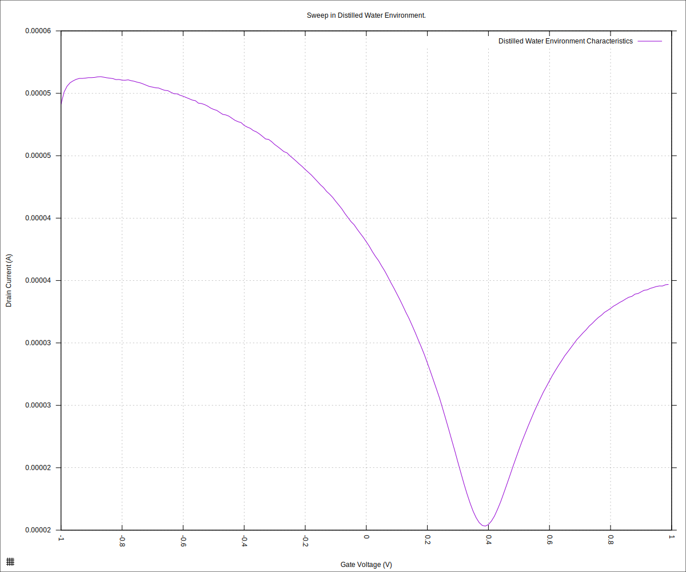
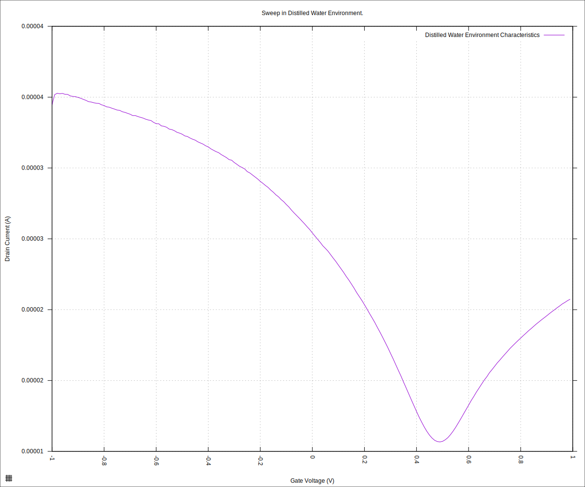
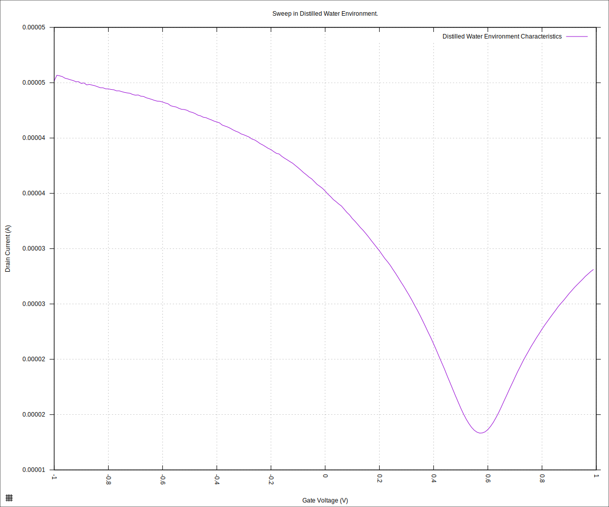
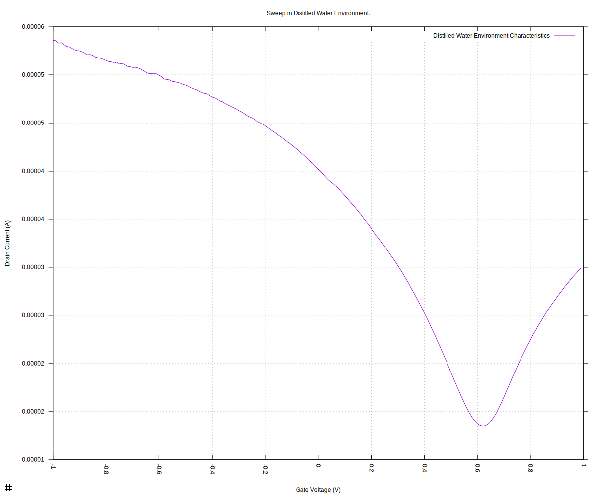
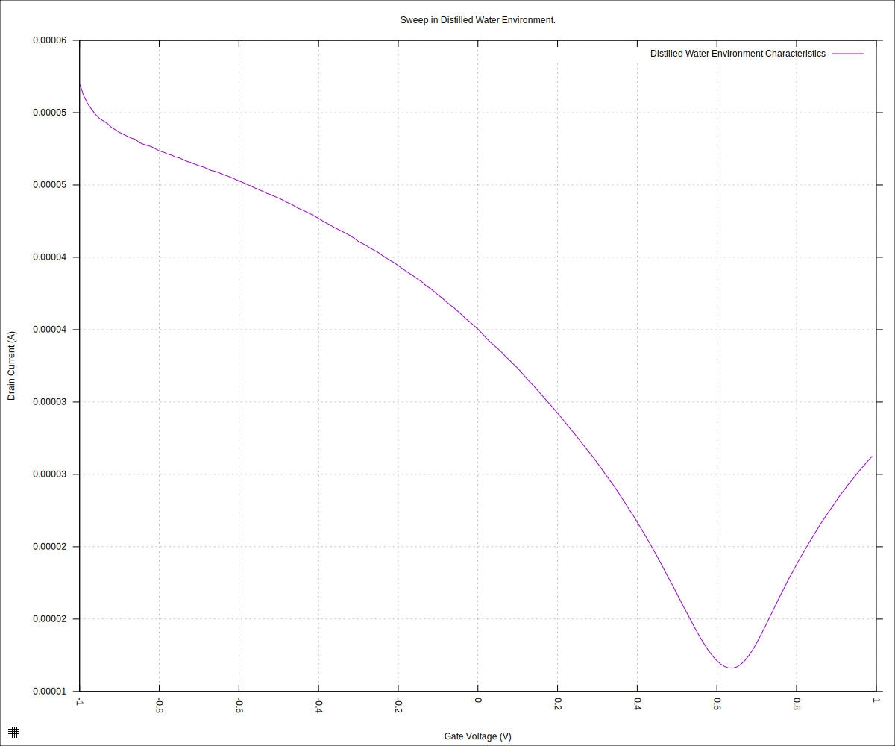
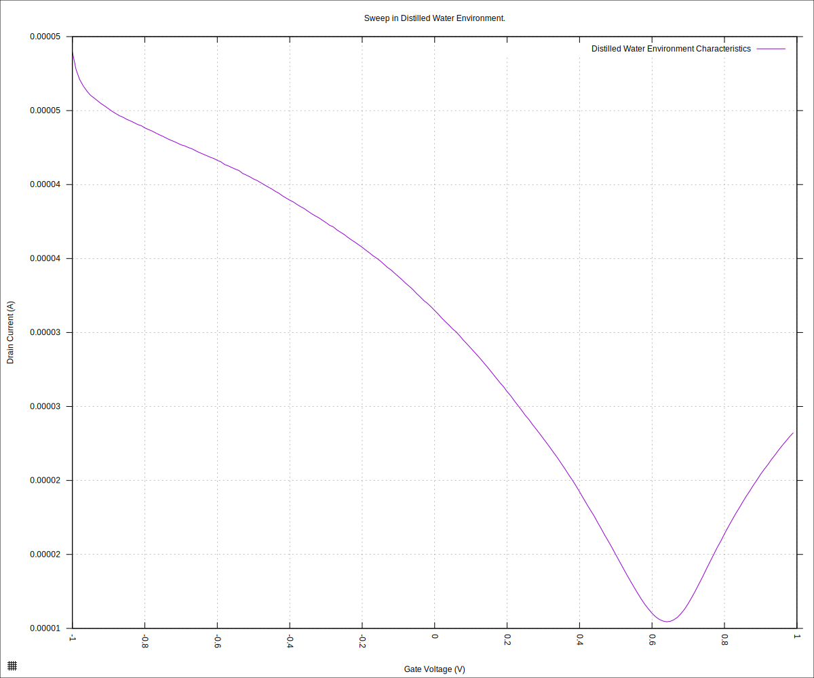
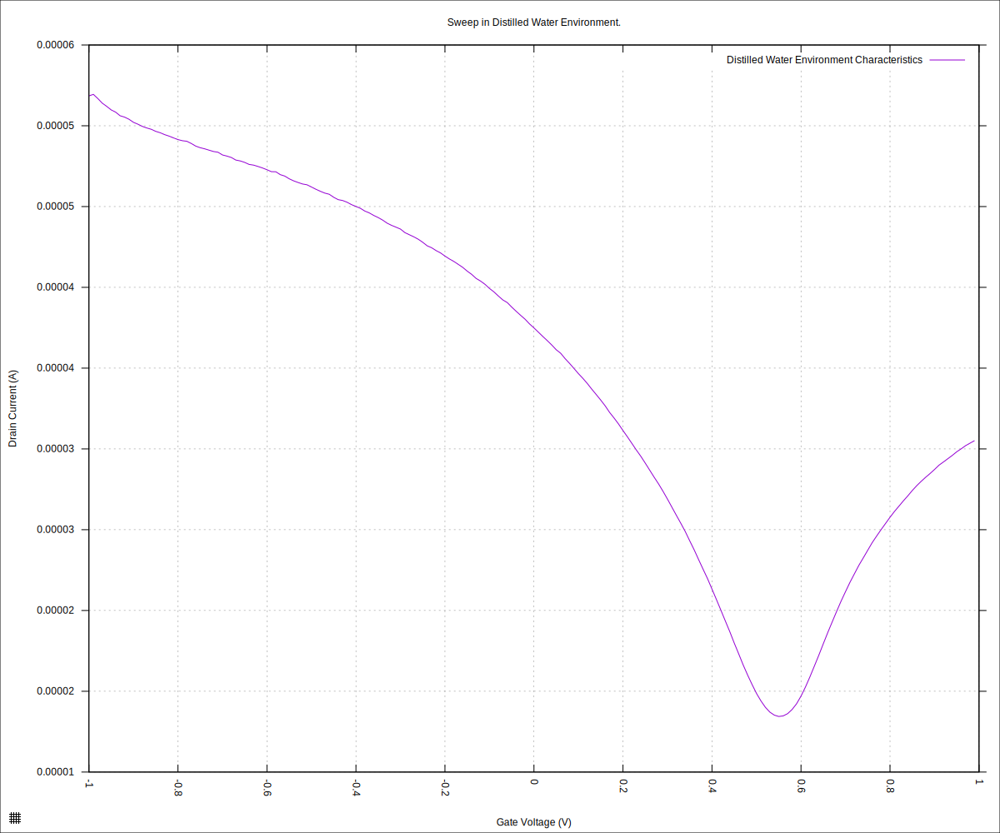
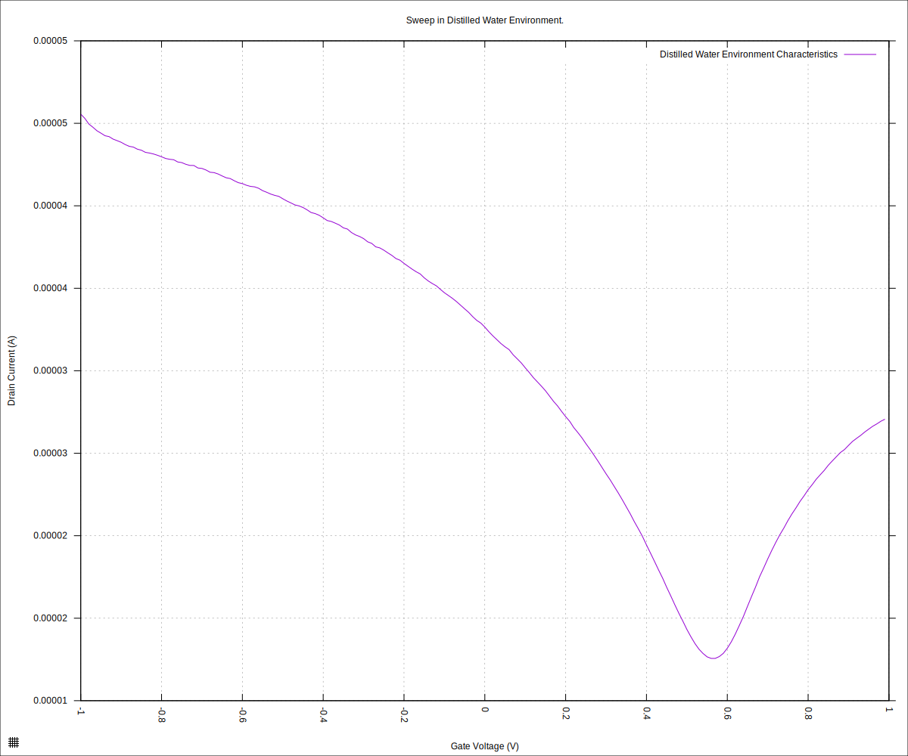

#+STARTUP: content
#+TITLE: Progress Report and Updates: 2026-06-05
#+AUTHOR: Frederick Muriuki Muriithi
#+PROPERTY: header-args:shell
#+LATEX_HEADER_EXTRA: \usepackage{svg}
#+BIBLIOGRAPHY: references.bib
#+CITE_EXPORT: natbib kluwer
#+LATEX_HEADER_EXTRA: \usepackage{fontspec}
#+LATEX: \setmainfont{Liberation Serif}
#+AUTO_TANGLE: t
#+OPTIONS: ^:{}

* Integration

** Plan

- [ ] Verify side B's results
- [ ] Test all of side B's channels
  - [ ] Source 01
  - [ ] Source 02
  - [ ] Source 03
  - [ ] Source 04
  - [ ] Source 05
  - [ ] Source 06
- [ ] Check side A contacts, especially drain terminal and common/ground
  terminal contacts

** Data Verification

We were using the GFET connected on the "Source 05" wire. Start by verifying
that works.

To go about this, we'll start by discarding all the older aliquots of ultrapure
distilled water. Next, we do a flush of the container with some new ultrapure
distilled water to get rid of any contamination, or at the very least, reduce
any contamination to virtual insignificance.

We now take the chip from vacuum storage and load it onto the cartridge.

Now pipette a small amount of the aliquot (~60µL) of the ultrapure distilled
water and drop it into the drop-type reservoir above the chip.

Now we can run the data verification steps beginning with the "Source 05" GFET.

#+begin_src shell
  mkdir -pv "fd-test-01/$(date +'%Y%m%d')" && \
      python3 sweep.py \
              --log-level debug \
              --smu-visa-address ASRL/dev/ttyUSB0::INSTR \
              --line-frequency 60 \
              --nplc 12.5005 \
              --gate_voltage 1.0 \
              --sweep_interval 0.01 \
              --channel-voltage 0.05 \
              --raise-keithley-errors \
              > "fd-test-01/$(date +'%Y%m%d')/$(date +'%Y%m%d')-001-water-readings.csv" \
              2> "fd-test-01/$(date +'%Y%m%d')/$(date +'%Y%m%d')-001-water-events.txt" && \
      python3 isswisafre.py process-data \
              "fd-test-01/$(date +'%Y%m%d')/$(date +'%Y%m%d')-001-water-readings.csv" \
              "fd-test-01/$(date +'%Y%m%d')/"
#+end_src

That series of commands collects the data and pre-processes it into files we can
use for generating the plot. We use the usual template for generating our plot.

#+begin_src gnuplot :tangle ./20260605-001-water-readings.gp
  load "./20260220-plotting-styles.gp"

  set output "./static/20260605-001-water-readings-positive.svg"

  set title "Sweep in Distilled Water Environment."
  set xlabel "Gate Voltage (V)"
  set ylabel "Drain Current (A)"
  set datafile separator ","
  plot \
       "./static/20260605-001-water-readings_positive.csv" \
       using "measured_gate_voltage":"drain_current" \
       title "Distilled Water Environment Characteristics" \
       with lines
#+end_src

which gives us:

#+CAPTION: Chip characteristics with ultra-pure distilled water on the same chip as 2026-06-01. This is intended to verify whether or not the GFET on side B of the cartridge and contacted by the terminal connected to the wire labelled "source 5" gives a good reading.
#+NAME: 20260605-001-water-readings-positive

The source files for the data are as follows:

- [[file:static/20260605-001-water-readings.csv]]: The raw data generated by the
  sweep command above.
- [[file:static/20260605-001-water-readings_positive.csv]]: One of the
  preprocessed files; the results for +50mV channel voltage. This is the data
  used to generate the plot
- [[file:static/20260605-001-water-readings_negative.csv]]: One of the
  preprocessed file; the results for -50mV channel voltages. This is effectively
  a reflection for the +50mV data.

<<<Enter conclusions here>>>

** Test All of Side B

The commands to generate the data, preprocess it and produce the plots are
similar to those above, with only the experiment/file number for the day
changing.

I did not disconnect the cartridge or change out the droplet of fluid in the
reservoir in any way. The only change was that I changed which wire was
connected to the sensor terminal of the source-measure unit (SMU).

*** Source 01

#+CAPTION: Chip characteristics with ultra-pure distilled water. Side B, Source 01.
#+NAME: 20260605-002-water-readings-positive

The source files for the data are as follows:

- [[file:static/20260605-002-water-readings.csv]]: Raw data.
- [[file:static/20260605-002-water-readings-positive.csv]]: +50mV channel
  voltage.
- [[file:static/20260605-002-water-readings-negative.csv]]: -50mV channel
  voltages.

*** Source 02

#+CAPTION: Chip characteristics with ultra-pure distilled water. Side B, Source 02.
#+NAME: 20260605-003-water-readings-positive

The source files for the data are as follows:

- [[file:static/20260605-003-water-readings.csv]]: Raw data.
- [[file:static/20260605-003-water-readings-positive.csv]]: +50mV channel
  voltage.
- [[file:static/20260605-003-water-readings-negative.csv]]: -50mV channel
  voltages.

*** Source 03

#+CAPTION: Chip characteristics with ultra-pure distilled water. Side B, Source 03.
#+NAME: 20260605-004-water-readings-positive

The source files for the data are as follows:

- [[file:static/20260605-004-water-readings.csv]]: Raw data.
- [[file:static/20260605-004-water-readings-positive.csv]]: +50mV channel
  voltage.
- [[file:static/20260605-004-water-readings-negative.csv]]: -50mV channel
  voltages.

*** Source 04

#+CAPTION: Chip characteristics with ultra-pure distilled water. Side B, Source 04.
#+NAME: 20260605-005-water-readings-positive

The source files for the data are as follows:

- [[file:static/20260605-005-water-readings.csv]]: Raw data.
- [[file:static/20260605-005-water-readings-positive.csv]]: +50mV channel
  voltage.
- [[file:static/20260605-005-water-readings-negative.csv]]: -50mV channel
  voltages.

*** Source 06

*NOTE*: I made a mistake with this one; I did not actually change the connection
on the SMU to the wire for Source 06, so the data we got was simply a re-run of
the sweep on "Source 05" 😭. I retain the data because I went through the hassle
of acquiring it in the first place.
Perhaps I should start looking into building a multiplexer of sorts, and try
convincing my funding to cover that escapade 🤔.

#+CAPTION: Chip characteristics with ultra-pure distilled water. Side B, Source 06.
#+NAME: 20260605-006-water-readings-positive

The source files for the data are as follows:

- [[file:static/20260605-006-water-readings.csv]]: Raw data.
- [[file:static/20260605-006-water-readings-positive.csv]]: +50mV channel
  voltage.
- [[file:static/20260605-006-water-readings-negative.csv]]: -50mV channel
  voltages.

*** Conclusions

All these give the expected results, with a nice and clean dirac point visible.

** Check Side A

We now flip the cartridge over, without changing anything else, and connect port
A of the cartridge to the SMU.

We then run the commands as usual and generate the data and plots.

*** Source 01

#+CAPTION: Chip characteristics with ultra-pure distilled water. Side A, Source 01.
#+NAME: 20260605-007-water-readings-positive

The source files for the data are as follows:

- [[file:static/20260605-007-water-readings.csv]]: Raw data.
- [[file:static/20260605-007-water-readings-positive.csv]]: +50mV channel
  voltage.
- [[file:static/20260605-007-water-readings-negative.csv]]: -50mV channel
  voltages.

*** Source 02

#+CAPTION: Chip characteristics with ultra-pure distilled water. Side A, Source 02.
#+NAME: 20260605-008-water-readings-positive

The source files for the data are as follows:

- [[file:static/20260605-008-water-readings.csv]]: Raw data.
- [[file:static/20260605-008-water-readings-positive.csv]]: +50mV channel
  voltage.
- [[file:static/20260605-008-water-readings-negative.csv]]: -50mV channel
  voltages.

*** Source 03

*** Source 04

*** Source 05

*** Source 06

*** Conclusions

🤦🏿‍♂️ It looks like this time, side A is working as expected too for some reason.
I have no idea why it was failing in the previous attempt - maybe I did not
tighten the cartridge correctly?
