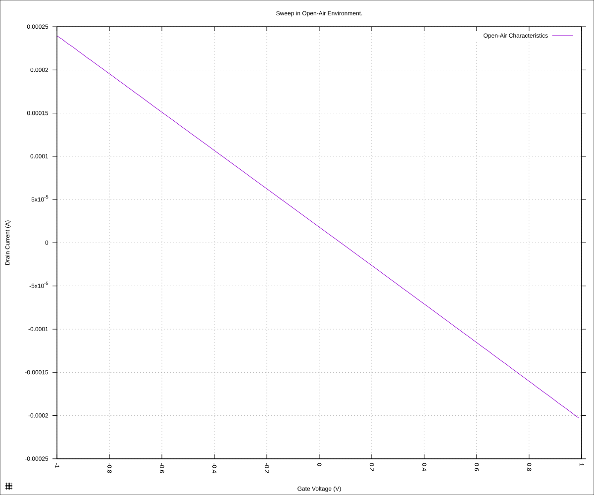
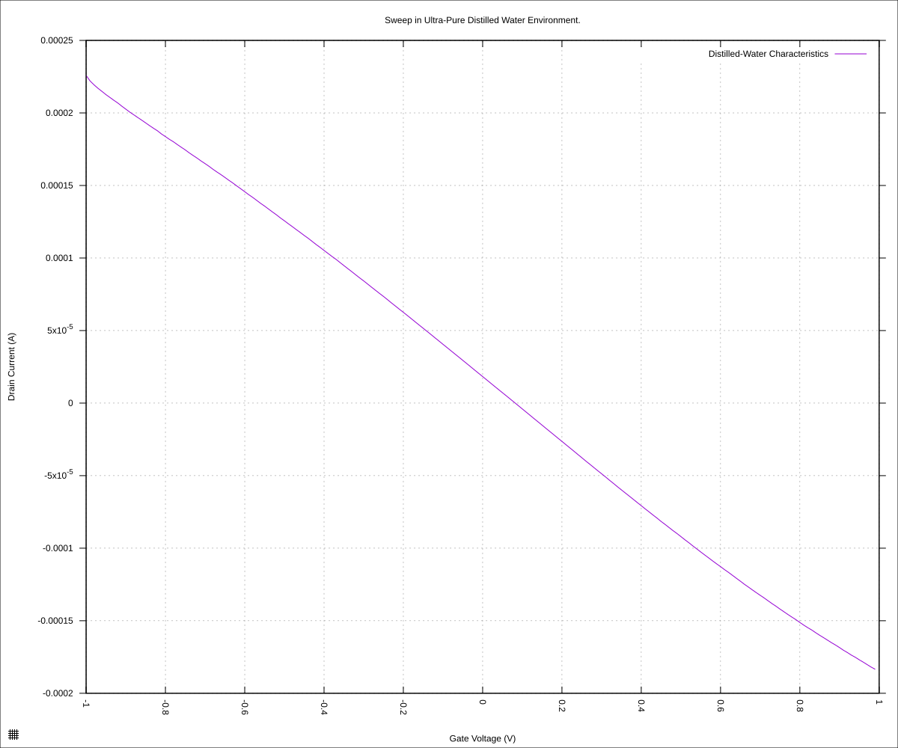
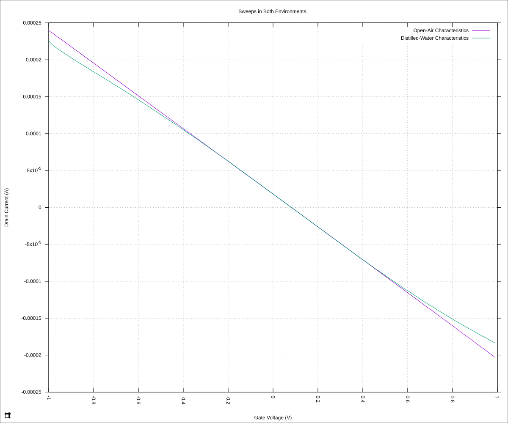

#+STARTUP: content
#+TITLE: Progress Report and Updates: 2026-09-18
#+AUTHOR: Frederick Muriuki Muriithi
#+PROPERTY: header-args:shell
#+LATEX_HEADER_EXTRA: \usepackage{svg}
#+BIBLIOGRAPHY: references.bib
#+CITE_EXPORT: natbib kluwer
#+LATEX_HEADER_EXTRA: \usepackage{fontspec}
#+LATEX: \setmainfont{Liberation Serif}
#+AUTO_TANGLE: t
#+OPTIONS: ^:{}

* Integrations

Goals:

- [X] Test reading with SMUconnected to graphenea card
  - i.e. SMU is connected to Graphenea card, and a chip installed. Reagent is
    placed manually on the chip using a hand-held pipette and signals run.
- [-] Explore python code to run the robot, simulating reads with SMU
  - i.e. The SMU will not actually be connected/hooked-up to the Graphenea card
    in this test

** Experiment 00: Graphenea Card on SMU

The steps:

- [X] Label the contacts on the SMU inputs cable for =Gate=, =Source= and
  =Drain= (signals' line).
- [X] Unhook the SMU inputs cable from the cartridge signals cable
- [X] Hook up the SMU inputs cable to one side of the graphenea card such that:
  - SMU Gate inputs <==> Graphenea card GG1 input
  - SMU Drain inputs <==> Graphenea card GD1 input
  - SMU Source inputs <==> Graphenea card GS1 input
- [X] Turn on the SMU
  - This should be turned on and left for about 2 hours to stabilise
- [X] Take chip out of storage and mount it on to the Graphenea chip
- [X] Switch the source input on the Graphenea card to *ON* position
- [X] Switch the the global Gate, Source and Drain inputs on the Graphenea card
  to *ON* position
- [X] Run scan on dry chip
- [X] Drop 10µL on the chip
- [X] Run a scan with fluid on chip
- [X] Aspirate away the drop of water from the chip and run N_{2} over it to dry
  the chip
- [X] Store chip away in vacuum
- [X] Move card switches to their respective *OFF* positions
- [X] Write up results
- [X] Turn off the SMU

*** Scan on Dry Chip

#+begin_src shell
  mkdir -pv "fd-test-01/$(date +'%Y%m%d')" && \
      python3 sweep.py \
              --raise-keithley-errors \
              --smu-visa-address ASRL/dev/ttyUSB0::INSTR \
              --line-frequency 60 \
              --nplc 12.5005 \
              --gate_voltage 1 \
              --sweep_interval 0.01\
              --channel-voltage 0.05 \
              > \
              "fd-test-01/$(date +'%Y%m%d')/$(date +'%Y%m%d')-00-dry-chip.csv" \
              2> \
              "fd-test-01/$(date +'%Y%m%d')/$(date +'%Y%m%d')-00-dry-chip-events.csv"
#+end_src

*** Scan with Drop of distilled water

#+begin_src shell
  python3 sweep.py \
          --raise-keithley-errors \
          --smu-visa-address ASRL/dev/ttyUSB0::INSTR \
          --line-frequency 60 \
          --nplc 12.5005 \
          --gate_voltage 1 \
          --sweep_interval 0.01\
          --channel-voltage 0.05 \
          > \
          "fd-test-01/$(date +'%Y%m%d')/$(date +'%Y%m%d')-01-water-on-chip.csv" \
          2> \
          "fd-test-01/$(date +'%Y%m%d')/$(date +'%Y%m%d')-01-water-on-chip-events.csv"
#+end_src

*** Analysis

Split the results:

#+begin_src shell
  python3 isswisafre.py process-data \
          "fd-test-01/$(date +'%Y%m%d')/$(date +'%Y%m%d')-00-dry-chip.csv" \
          "fd-test-01/$(date +'%Y%m%d')/"
  python3 isswisafre.py process-data \
          "fd-test-01/$(date +'%Y%m%d')/$(date +'%Y%m%d')-01-water-on-chip.csv" \
          "fd-test-01/$(date +'%Y%m%d')/"
#+end_src

then plot the results:

#+begin_src gnuplot :tangle ./20260918-00-dry-chip.gp
  load "./20260220-plotting-styles.gp"

  set output "./static/20260918-00-dry-chip.svg"

  set title "Sweep in Open-Air Environment."
  set xlabel "Gate Voltage (V)"
  set ylabel "Drain Current (A)"
  set datafile separator ","
  plot \
       "./static/20260918-00-dry-chip-positive.csv" \
       using "measured_gate_voltage":"drain_current" \
       title "Open-Air Characteristics" \
       with lines
#+end_src

#+CAPTION: mGFET-4D characteristics in open-air
#+NAME: 20260918-00-dry-chip-positive

#+begin_src gnuplot :tangle ./20260918-01-water-on-chip.gp
  load "./20260220-plotting-styles.gp"

  set output "./static/20260918-01-water-on-chip.svg"

  set title "Sweep in Ultra-Pure Distilled Water Environment."
  set xlabel "Gate Voltage (V)"
  set ylabel "Drain Current (A)"
  set datafile separator ","
  plot \
       "./static/20260918-01-water-on-chip-positive.csv" \
       using "measured_gate_voltage":"drain_current" \
       title "Distilled-Water Characteristics" \
       with lines
#+end_src

#+CAPTION: mGFET-4D characteristics in distilled water
#+NAME: 20260918-01-water-on-chip-positive

#+begin_src gnuplot :tangle ./20260918-01-combined.gp
  load "./20260220-plotting-styles.gp"

  set output "./static/20260918-01-combined.svg"

  set title "Sweeps in Both Environments."
  set xlabel "Gate Voltage (V)"
  set ylabel "Drain Current (A)"
  set datafile separator ","
  plot \
       "./static/20260918-00-dry-chip-positive.csv" \
       using "measured_gate_voltage":"drain_current" \
       title "Open-Air Characteristics" \
       with lines, \
       "./static/20260918-01-water-on-chip-positive.csv" \
       using "measured_gate_voltage":"drain_current" \
       title "Distilled-Water Characteristics" \
       with lines
#+end_src

#+CAPTION: mGFET-4D characteristics — combined plots
#+NAME: 20260918-01-combined-positive

The characteristic plots are very similar for both open-air and distilled water.

Looking at the [[https://cdn.shopify.com/s/files/1/0191/2296/files/2026_mGFET-D_4x4_v7_TDS_06-18-2026.pdf?v=1781775112][mGFET-4D datasheet]], the "Dirac point (liquid gating in PBS)" for
the mGFET-4D chip is defined as being ~<1.5V~.  The
[[https://cdn.shopify.com/s/files/1/0191/2296/files/2026_Measurement_Protocols_mGFET_v3_27-02-2026.pdf?v=1776929336][Measurement Protocols and Handling Instructions]] manual at just slightly over 1V.

The fact that both curves are similar indicates that something was not done
correctly. Possible issues could be

There is no noise for the open-air characteristics, or even a near-horizontal result

- connections were inverted i.e. source connected to drain and vice-versa
  This is probably not the issue, looking at the "steps" list at the beginning
  of this document.
- The chip orientation: this is a possibility. The problem here is the fact that
  the gate on the chip is on pins 9 and 18, and the drain on the chip is on
  pins 8 and 17. These need to be oriented correctly on the LCC pad.
  The problem, here, is that it is difficult to identify the pins on the chip.
  The identifier is really subtle, and was only noted after looking at the chip
  more carefully during this analysis to try and figure out what went wrong.

The results we got above are, therefore, more the results of "crossing wires"
than actually doing what we wanted to do.

At the very least, it assures us that the connections work -- for a fuzzy value
of "work".

** Experiment 01: Python Code Running OT-2R Robot Without SMU Connected

*** Configurations

There are a few things we need to configure at the outset, before we run anything:

- The path(s) to any custom labware/module/… definitions to be loaded onto the
  OT-2R
- The path to a "starter" protocol that defines fluids (reagents) to be used in
  the run
- List of  (use the human-friendly names for these):
  - labware
  - modules
  - …
    

*** Idea

- [ ] For each command, get the results, and generate an appropriate data object
- [ ] Setup maintenance run
  - [ ] Include path to "starter" protocol
- [ ] Retrieve ID(s) of reagent(s) defined in the "starter" protocol and stash
  them in some sort of lookup table
- [ ] Upload any custom definition(s)
- [ ] Load pipette(s) to use
  - [ ] Give (each) pipette a unique ID and add that to a lookup table of sorts
    - Perhaps look into a ~with_pipette(…)~ pattern
- [ ] Load labware
- 
