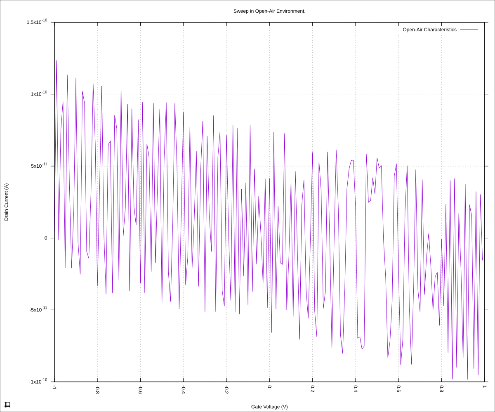
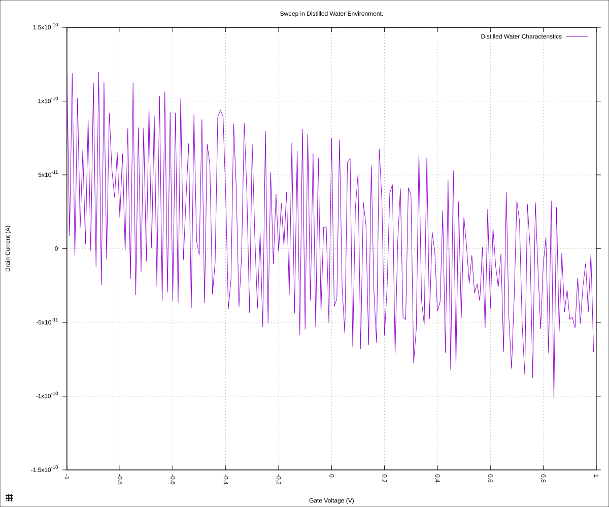

#+STARTUP: content
#+TITLE: Progress Report and Updates: 2026-09-21
#+AUTHOR: Frederick Muriuki Muriithi
#+PROPERTY: header-args:shell
#+LATEX_HEADER_EXTRA: \usepackage{svg}
#+BIBLIOGRAPHY: references.bib
#+CITE_EXPORT: natbib kluwer
#+LATEX_HEADER_EXTRA: \usepackage{fontspec}
#+LATEX: \setmainfont{Liberation Serif}
#+AUTO_TANGLE: t
#+OPTIONS: ^:{}

* Integrations

The goals today are as follows:

- [-] Read from chip on Graphenea card
  - [X] Turn on the SMU and wait 2 hours for stabilisation
  - [X] Chip orientation
    - [X] Verify chip orientation from datasheets
    - [X] Take chip from vacuum storage
    - [X] Check orientation and load onto LCC pad
    - [X] Verify the orientation is correct one more time
  - [ ] Read runs
    - [ ] Run sweep on SMU with chip exposed to open air
    - [ ] Drop 10µL of ultrapure distilled water on chip and run sweep
- [ ] Proceed with implementation of OT-2R orchestration code
  - 

** Experiment 00: Graphenea Card on SMU: Open-Air

#+begin_src shell
  mkdir -pv "fd-test-01/$(date +'%Y%m%d')" && \
      python3 sweep.py \
              --raise-keithley-errors \
              --smu-visa-address ASRL/dev/ttyUSB0::INSTR \
              --line-frequency 60 \
              --nplc 12.5005 \
              --gate_voltage 1 \
              --sweep_interval 0.01\
              --channel-voltage 0.05 \
              > \
              "fd-test-01/$(date +'%Y%m%d')/$(date +'%Y%m%d')-00-dry-chip.csv" \
              2> \
              "fd-test-01/$(date +'%Y%m%d')/$(date +'%Y%m%d')-00-dry-chip-events.csv" && \
      python3 isswisafre.py process-data \
              "fd-test-01/$(date +'%Y%m%d')/$(date +'%Y%m%d')-00-dry-chip.csv" \
              "fd-test-01/$(date +'%Y%m%d')/"
#+end_src

** Experiment 02: Graphenea Card on SMU: Distilled Water

This should have been done yesterday (2026-09-21), instead, we are doing it today. The commands will vary just slightly.

#+begin_src shell
  export EXPTDATE="20260921";
  python3 sweep.py \
          --raise-keithley-errors \
          --smu-visa-address ASRL/dev/ttyUSB0::INSTR \
          --line-frequency 60 \
          --nplc 12.5005 \
          --gate_voltage 1 \
          --sweep_interval 0.01\
          --channel-voltage 0.05 \
          > \
          "fd-test-01/${EXPTDATE}/${EXPTDATE}-00-distilled-water.csv" \
          2> \
          "fd-test-01/${EXPTDATE}/${EXPTDATE}-00-distilled-water-events.csv" && \
      python3 isswisafre.py process-data \
              "fd-test-01/${EXPTDATE}/${EXPTDATE}-00-distilled-water.csv" \
              "fd-test-01/${EXPTDATE}/"
#+end_src

** Analysis

With the chip open to the air, the plot of the data becomes:

#+begin_src gnuplot :tangle ./20260921-00-dry-chip.gp
  load "./20260220-plotting-styles.gp"

  set output "./static/20260921-00-dry-chip.svg"

  set title "Sweep in Open-Air Environment."
  set xlabel "Gate Voltage (V)"
  set ylabel "Drain Current (A)"
  set datafile separator ","
  plot \
       "./static/20260921-00-dry-chip-positive.csv" \
       using "measured_gate_voltage":"drain_current" \
       title "Open-Air Characteristics" \
       with lines
#+end_src

which gives:

#+CAPTION: Sweep with chip open to air (no water drop)
#+NAME: 20260921-00-dry-chip

The dry chip shows noise, varying from about -100pA to about +120pA: really
small currents. I'm guessing probably tiny stray currents.

With a drop of ultrapure distilled water, we generate the plot with:

#+begin_src gnuplot :tangle ./20260921-00-distilled-water.gp
  load "./20260220-plotting-styles.gp"

  set output "./static/20260921-00-distilled-water.svg"

  set title "Sweep in Distilled Water Environment."
  set xlabel "Gate Voltage (V)"
  set ylabel "Drain Current (A)"
  set datafile separator ","
  plot \
       "./static/20260921-00-distilled-water-positive.csv" \
       using "measured_gate_voltage":"drain_current" \
       title "Distilled Water Characteristics" \
       with lines
#+end_src

#+CAPTION: Sweep with ultrapure distilled water on chip
#+NAME: 20260921-00-distilled-water

Also noisy — why?

Oops! I left the switches in the off state: we were not getting the signal to the chip!
