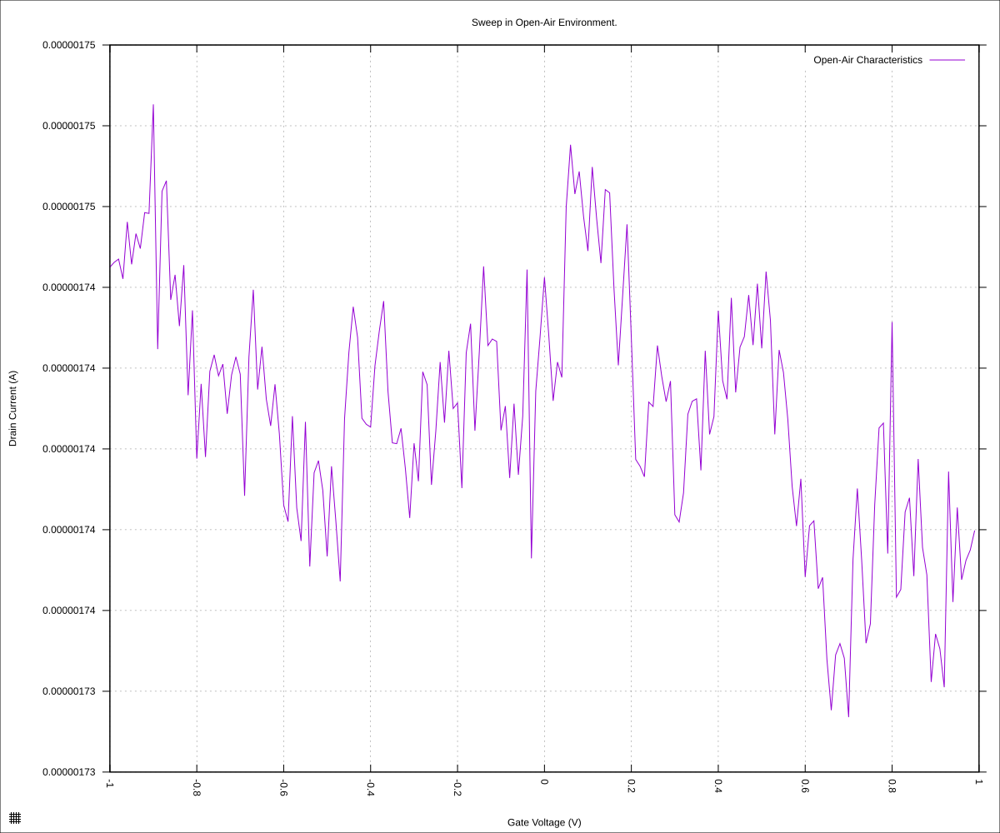
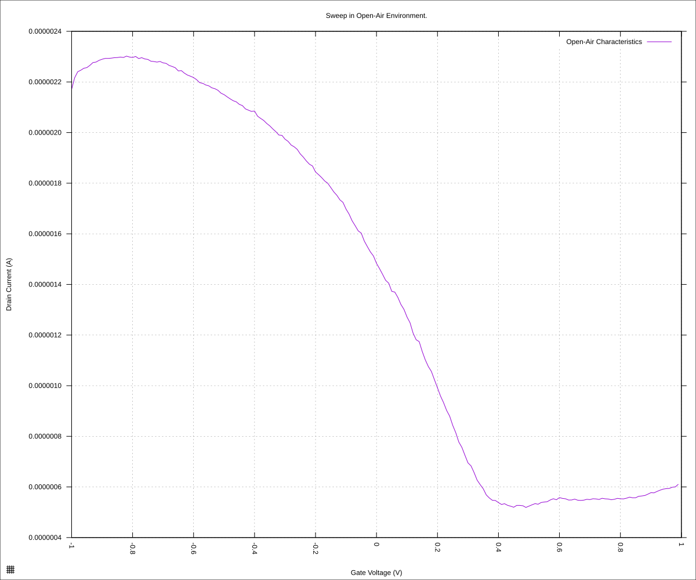

#+STARTUP: content
#+TITLE: Progress Report and Updates: 2026-09-22
#+AUTHOR: Frederick Muriuki Muriithi
#+PROPERTY: header-args:shell
#+LATEX_HEADER_EXTRA: \usepackage{svg}
#+BIBLIOGRAPHY: references.bib
#+CITE_EXPORT: natbib kluwer
#+LATEX_HEADER_EXTRA: \usepackage{fontspec}
#+LATEX: \setmainfont{Liberation Serif}
#+AUTO_TANGLE: t
#+OPTIONS: ^:{}

* Integrations

Fix the silly mistake from yesterday

Begin by running scan with chip in open air

#+begin_src shell
  mkdir -pv "fd-test-01/$(date +'%Y%m%d')" && \
      python3 sweep.py \
              --raise-keithley-errors \
              --smu-visa-address ASRL/dev/ttyUSB0::INSTR \
              --line-frequency 60 \
              --nplc 12.5005 \
              --gate_voltage 1 \
              --sweep_interval 0.01\
              --channel-voltage 0.05 \
              > \
              "fd-test-01/$(date +'%Y%m%d')/$(date +'%Y%m%d')-00-dry-chip.csv" \
              2> \
              "fd-test-01/$(date +'%Y%m%d')/$(date +'%Y%m%d')-00-dry-chip-events.csv" && \
      python3 isswisafre.py process-data \
              "fd-test-01/$(date +'%Y%m%d')/$(date +'%Y%m%d')-00-dry-chip.csv" \
              "fd-test-01/$(date +'%Y%m%d')/"
#+end_src

then put 10µL of ultrapure distilled water on the chip and do another scan

#+begin_src shell
  python3 sweep.py \
          --raise-keithley-errors \
          --smu-visa-address ASRL/dev/ttyUSB0::INSTR \
          --line-frequency 60 \
          --nplc 12.5005 \
          --gate_voltage 1 \
          --sweep_interval 0.01\
          --channel-voltage 0.05 \
          > \
          "fd-test-01/$(date +'%Y%m%d')/$(date +'%Y%m%d')-00-distilled-water.csv" \
          2> \
          "fd-test-01/$(date +'%Y%m%d')/$(date +'%Y%m%d')-00-distilled-water-events.csv" && \
      python3 isswisafre.py process-data \
              "fd-test-01/$(date +'%Y%m%d')/$(date +'%Y%m%d')-00-distilled-water.csv" \
              "fd-test-01/$(date +'%Y%m%d')/"
#+end_src

and now we can plot the results:

#+begin_src gnuplot :tangle ./20260922-00-dry-chip.gp
  load "./20260220-plotting-styles.gp"

  set output "./static/20260922-00-dry-chip.svg"

  set title "Sweep in Open-Air Environment."
  set xlabel "Gate Voltage (V)"
  set ylabel "Drain Current (A)"
  set datafile separator ","
  plot \
       "./static/20260922-00-dry-chip-positive.csv" \
       using "measured_gate_voltage":"drain_current" \
       title "Open-Air Characteristics" \
       with lines
#+end_src

and

#+begin_src gnuplot :tangle ./20260922-00-distilled-water.gp
  load "./20260220-plotting-styles.gp"

  set output "./static/20260922-00-distilled-water.svg"

  set title "Sweep in Open-Air Environment."
  set xlabel "Gate Voltage (V)"
  set ylabel "Drain Current (A)"
  set datafile separator ","
  plot \
       "./static/20260922-00-distilled-water-positive.csv" \
       using "measured_gate_voltage":"drain_current" \
       title "Open-Air Characteristics" \
       with lines
#+end_src

the plot for the open-air configuration becomes

#+CAPTION: Sweep with chip exposed to open air
#+NAME: 20260922-00-dry-chip

This is mostly noise, as expected, and the currents are in the micro range.

The sweep with the distilled water, on the other hand, gives us

#+CAPTION: Sweep with a drop (10µL) of ultrapure distilled water
#+NAME: 20260922-00-distilled-water

This is shaped more like what we expect, though the rise is not as sharp as,
say, the S20 chips. We see the Dirac point is around +0.4V

** Lessons/Gotchas

- Verify the orientation of the chips on the LCC pad
- Remember to always turn on the switches on the Graphenea card before scans
